# Tutorial: Implementação de Somador de Ponto Flutuante na DE10-Lite

**Autores:** Kayky de Brito dos Santos, Igor Domingos da Silva Mozetic, Andre Luis Penha da Silva

**Disciplina:** MCTA024 - Sistemas Digitais - Q2.2026

**Data:** 10 de agosto de 2026

---

## Sumário

| Seção | Conteúdo | Etapa da disciplina |
|---|---|---|
| [1](#1-objetivo-do-projeto) | Objetivo do projeto | - |
| [2](#2-descrição-gráfica-do-funcionamento-do-sistema) | Descrição gráfica do funcionamento | Etapa 1 |
| [3](#3-adaptações-de-hardware-de10-lite) | Adaptações de hardware | Etapa 2 |
| [4](#4-evidências-de-validação) | Evidências de validação (simulação, código, placa) | Etapas 2 e 3 |
| [5](#5-diário-de-bordo-de-ia) | Diário de bordo de IA | Etapa 4 |
| [6](#6-contribuição-dos-participantes) | Contribuição dos participantes (CRediT) | Etapa 4 |

---

*Etapa 1*

## 1. Objetivo do Projeto

Este projeto adapta o somador de ponto flutuante simplificado de 13 bits da Listing 3.19 de
*FPGA Prototyping by VHDL Examples* (Pong P. Chu, §3.7.4) – escrito para a placa Digilent S3
com Spartan-3 – para a placa **Terasic DE10-Lite** (Intel MAX 10, `10M50DAF484C7G`).

O objetivo é validar o algoritmo original por simulação, adequá-lo aos recursos físicos da
placa que temos, sintetizá-lo no Quartus Prime e demonstrar seu funcionamento no hardware
real, documentando o processo, inclusive o uso de IA.

### Formato numérico

O somador opera sobre um formato de 13 bits:

$$
v = (-1)^{s} \times \frac{f}{256} \times 2^{e}
$$

| Campo | Largura | Domínio |
|---|---|---|
| $s$: sinal | 1 bit | $s \in \{0, 1\}$, com $s = 1$ indicando número negativo |
| $e$: expoente | 4 bits | $e \in [0, 15]$, inteiro **sem sinal**, sem excesso (*bias*) |
| $f$: fração | 8 bits | $f \in [128, 255]$ – normalizada, bit 7 sempre `'1'` |

Equivalentemente, na notação do livro, $v = (-1)^{s} \times 0.f \times 2^{e}$, já que
$f / 256$ é exatamente a fração binária $0.f$ com 8 casas.

Os extremos de magnitude não nula são, portanto:

$$
v_{\min} = \frac{128}{256} \times 2^{0} = 0{,}5
\qquad\qquad
v_{\max} = \frac{255}{256} \times 2^{15} = 32640
$$

#### Exemplo de conversão: 70,5

**Ida: de decimal para o formato.** Escreve-se o número em binário e desloca-se a vírgula
até que só reste `0,` à esquerda, contando os deslocamentos:

$$
70{,}5_{10} = 1000110{,}1_{2} = \underbrace{0{,}10001101_{2}}_{f} \times 2^{\overbrace{7}^{e}}
$$

Foram **7** casas, então $e = 7 = 0111_2$. Os oito bits após a vírgula são a fração,
$f = 10001101_2 = 0\text{x}8D = 141$. O número é positivo, logo $s = 0$. O bit mais à
esquerda de $f$ sempre deve ser `'1'`, como exige a normalização, caso contrário o
deslocamento teria parado cedo demais.

Resultado: `0 0111 10001101`.

**Volta: do formato para decimal.** Basta aplicar a fórmula aos três campos:

$$
v = (-1)^{0} \times \frac{141}{256} \times 2^{7} = 0{,}55078125 \times 128 = 70{,}5
$$

A conversão neste caso é **exata** nos dois sentidos. Isso não é verdade para todos os números:
`0,52`, por exemplo, não é representável e vira `0,51953125`.

Para facilitar a conversão, montamos uma
[**planilha de conversão**](https://docs.google.com/spreadsheets/d/1j_V8zEg76kGf2R_ZsYSh-g7Jo0E3Xsyr38fk7qrj2FQ/edit)
que opera nos dois sentidos:

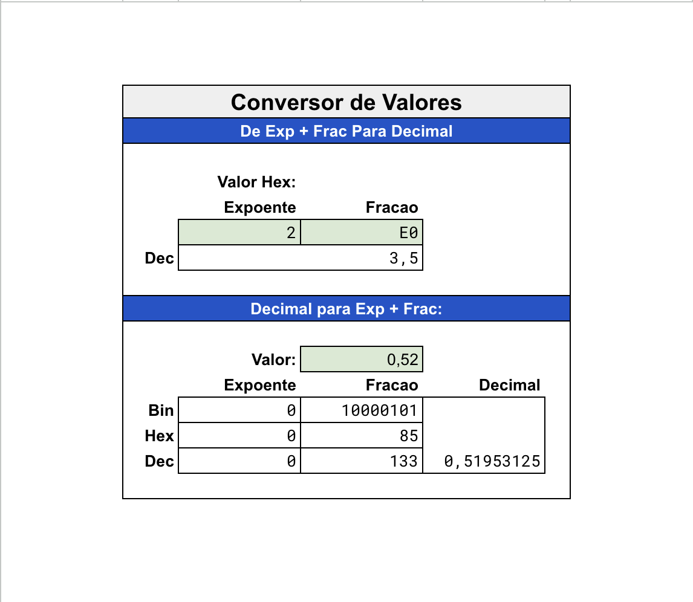

---

## 2. Descrição gráfica do funcionamento do sistema

### 2.1 Hierarquia dos módulos

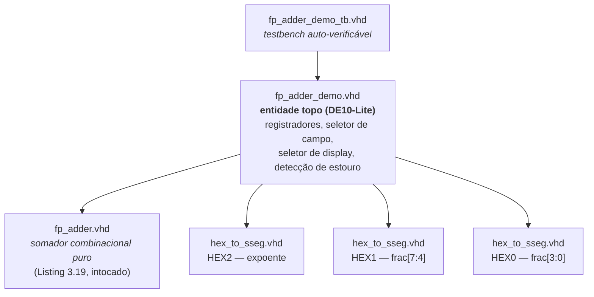
```mermaid
flowchart TD
    TB["fp_adder_demo_tb.vhd<br/><i>testbench auto-verificável</i>"] --> DEMO
    DEMO["fp_adder_demo.vhd<br/><b>entidade topo (DE10-Lite)</b><br/>registradores, seletor de campo,<br/>seletor de display, detecção de estouro"]
    DEMO --> ADD["fp_adder.vhd<br/><i>somador combinacional puro</i><br/>(Listing 3.19, intocado)"]
    DEMO --> S2["hex_to_sseg.vhd<br/>HEX2 — expoente"]
    DEMO --> S1["hex_to_sseg.vhd<br/>HEX1 — frac[7:4]"]
    DEMO --> S0["hex_to_sseg.vhd<br/>HEX0 — frac[3:0]"]
```

### 2.2 Estágios (`fp_adder.vhd`)

Como o somador é puramente combinacional, ele opera sem sinais de clock ou reset. O diagrama abaixo detalha o fluxo de dados do circuito, sem a necessidade de uma máquina de estados:

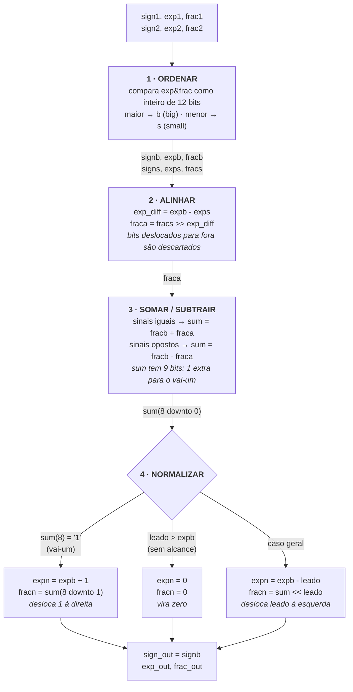
```mermaid
flowchart TD
    IN["sign1, exp1, frac1<br/>sign2, exp2, frac2"] --> E1

    E1["<b>1 · ORDENAR</b><br/>compara exp&frac como inteiro de 12 bits<br/>maior → b (big) · menor → s (small)"]
    E1 --> |"signb, expb, fracb<br/>signs, exps, fracs"| E2

    E2["<b>2 · ALINHAR</b><br/>exp_diff = expb - exps<br/>fraca = fracs >> exp_diff<br/><i>bits deslocados para fora são descartados</i>"]
    E2 --> |fraca| E3

    E3["<b>3 · SOMAR / SUBTRAIR</b><br/>sinais iguais → sum = fracb + fraca<br/>sinais opostos → sum = fracb - fraca<br/><i>sum tem 9 bits: 1 extra para o vai-um</i>"]
    E3 --> |"sum(8 downto 0)"| E4

    E4{"<b>4 · NORMALIZAR</b>"}
    E4 --> |"sum(8) = '1'<br/>(vai-um)"| N1["expn = expb + 1<br/>fracn = sum(8 downto 1)<br/><i>desloca 1 à direita</i>"]
    E4 --> |"leado > expb<br/>(sem alcance)"| N2["expn = 0<br/>fracn = 0<br/><i>vira zero</i>"]
    E4 --> |"caso geral"| N3["expn = expb - leado<br/>fracn = sum << leado<br/><i>desloca leado à esquerda</i>"]

    N1 --> OUT["sign_out = signb<br/>exp_out, frac_out"]
    N2 --> OUT
    N3 --> OUT
```

### 2.3 Quarto Estágio

**(a) Contagem de zeros à esquerda (`leado`)**: codificador de prioridade que identifica o bit '1' mais significativo a partir de `sum(7)`:

| Condição       | `leado` | Descrição                        |
| -------------- | ------- | -------------------------------- |
| `sum(7) = '1'` | 0       | Já normalizado                   |
| `sum(6) = '1'` | 1       | 1 zero à esquerda                |
| `sum(5) = '1'` | 2       | 2 zeros à esquerda               |
| `sum(4) = '1'` | 3       | 3 zeros à esquerda               |
| `sum(3) = '1'` | 4       | 4 zeros à esquerda               |
| `sum(2) = '1'` | 5       | 5 zeros à esquerda               |
| `sum(1) = '1'` | 6       | 6 zeros à esquerda               |
| Outros casos   | 7       | Bit `sum(0)` ativo ou valor nulo |

**(b) Deslocamento de normalização (`sum_norm`)**: desloca `sum(7 downto 0)` à esquerda de acordo com o valor de `leado`, preenchendo os bits restantes com zero.

**(c) Ajuste final**: cobre as quatro condições de borda validadas na simulação:

| Caso                             | Condição                       | Ação                                                                           | Referência do Livro            |
| -------------------------------- | ------------------------------ | ------------------------------------------------------------------------------ | ------------------------------ |
| **I — Sem ajuste**               | `sum(8)=0`, `leado=0`          | Mantém `expn = expb` e `fracn = sum`                                           | Ex. 1: `−0.82E4`<br>           |
| **II — Normalização à esquerda** | `sum(8)=0`, `0 < leado ≤ expb` | Decrementa o expoente (`expn = expb − leado`)                                  | Ex. 2: `−0.01E3 → −0.10E2`<br> |
| **III — Underflow (zerado)**     | `sum(8)=0`, `leado > expb`     | Força `expn = 0` e `fracn = 0`                                                 | Ex. 3: `−0.01E0 → −0.00E0`<br> |
| **IV — Carry-out no MSB**        | `sum(8)=1`                     | Incrementa o expoente (`expn = expb + 1`) e desloca a mantissa 1 bit à direita | Ex. 4: `+1.07E3 → +0.10E4`<br> |

### 2.4 Tabela verdade do decodificador (`hex_to_sseg.vhd`)

O decodificador de sete segmentos foi **reutilizado do Lab 3**, onde já havíamos implementado
e validado essa lógica em VHDL. A numeração dos segmentos é a mesma vista lá:


_Fig. 12 do roteiro do Lab 3 — decodificador e "Seven Segment Display"._

Os índices da figura correspondem diretamente aos bits do vetor de saída: o segmento `0` é o
traço superior (`a`), e a numeração segue no sentido horário até o `5` (`f`), com o `6` sendo
o traço central (`g`).

Os displays de 7 segmentos da DE10-Lite operam em **lógica invertida (ativo em nível baixo)**, ou seja, o bit `'0'` acende o segmento.

O mapeamento dos bits segue o padrão:

- `sseg(6 downto 0)` = `g f e d c b a`
- `sseg(7)` = `not dp` (ponto decimal)

| `hex` | Dígito | `sseg(6:0)` |     | `hex` | Dígito | `sseg(6:0)` |
| ----- | ------ | ----------- | --- | ----- | ------ | ----------- |
| 0000  | 0      | `1000000`   |     | 1000  | 8      | `0000000`   |
| 0001  | 1      | `1111001`   |     | 1001  | 9      | `0010000`   |
| 0010  | 2      | `0100100`   |     | 1010  | A      | `0001000`   |
| 0011  | 3      | `0110000`   |     | 1011  | b      | `0000011`   |
| 0100  | 4      | `0011001`   |     | 1100  | C      | `0100111`   |
| 0101  | 5      | `0010010`   |     | 1101  | d      | `0100001`   |
| 0110  | 6      | `0000010`   |     | 1110  | E      | `0000110`   |
| 0111  | 7      | `1111000`   |     | 1111  | F      | `0001110`   |

Um padrão usado no projeto **não está nesta tabela**: `0111111`, que acende apenas o segmento
`g` e desenha um traço. É o que o `HEX3` exibe quando o número mostrado é negativo.

### 2.5 Entradas e saídas da entidade topo

Todas as portas de `fp_adder_demo` e o papel de cada uma:

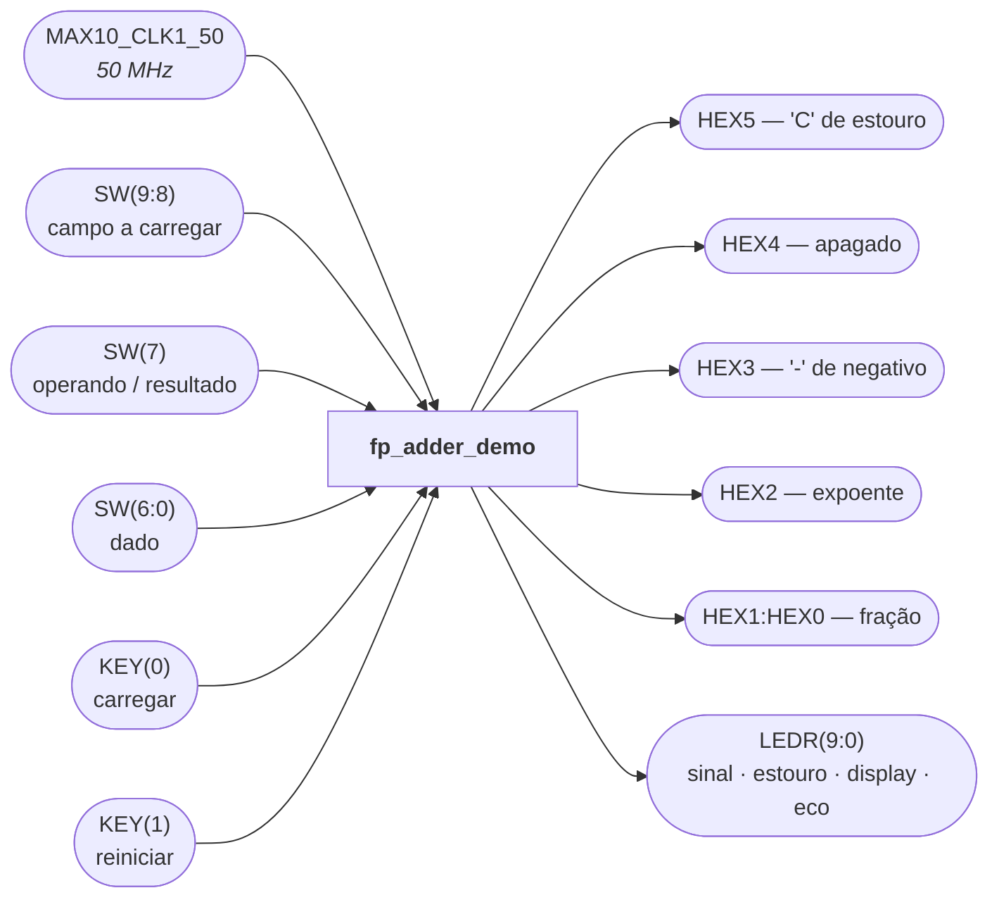
```mermaid
flowchart LR
    CLK(["MAX10_CLK1_50<br/><i>50 MHz</i>"]) --> TOP
    SW98(["SW(9:8)<br/>campo a carregar"]) --> TOP
    SW7(["SW(7)<br/>operando / resultado"]) --> TOP
    SW60(["SW(6:0)<br/>dado"]) --> TOP
    K0(["KEY(0)<br/>carregar"]) --> TOP
    K1(["KEY(1)<br/>reiniciar"]) --> TOP

    TOP["<b>fp_adder_demo</b>"]

    TOP --> H5(["HEX5 — 'C' de estouro"])
    TOP --> H4(["HEX4 — apagado"])
    TOP --> H3(["HEX3 — '-' de negativo"])
    TOP --> H2(["HEX2 — expoente"])
    TOP --> H10(["HEX1:HEX0 — fração"])
    TOP --> L(["LEDR(9:0)<br/>sinal · estouro · display · eco"])
```

Com `SW(7) = '0'`, o `SW(9:8)` escolhe o campo a ser editado e o operando correspondente
aparece nos displays. Com `SW(7) = '1'`, os displays mostram o resultado.

### 2.6 Fluxo de operação na placa

O circuito possui como único elemento sequencial o conjunto de seis registradores de entrada. O sistema atua como um banco de registradores com escrita seletiva, sem o uso de máquinas de estados. O fluxo de uso na placa segue a sequência descrita abaixo:

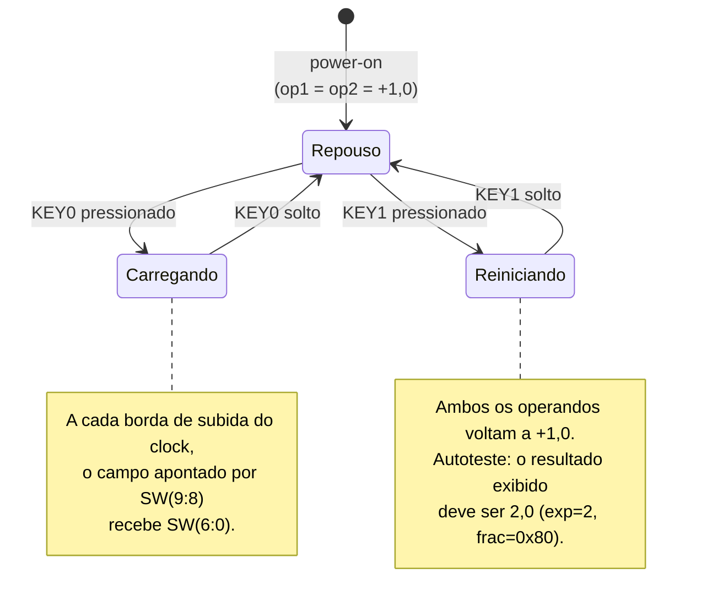
```mermaid
stateDiagram-v2
    [*] --> Repouso: power-on<br/>(op1 = op2 = +1,0)

    Repouso --> Carregando: KEY0 pressionado
    Carregando --> Repouso: KEY0 solto

    Repouso --> Reiniciando: KEY1 pressionado
    Reiniciando --> Repouso: KEY1 solto

    note right of Carregando
        A cada borda de subida do clock,
        o campo apontado por SW(9:8)
        recebe SW(6:0).
    end note

    note right of Reiniciando
        Ambos os operandos voltam a +1,0.
        Autoteste: o resultado exibido
        deve ser 2,0 (exp=2, frac=0x80).
    end note
```

O processamento combinacional, que abrange a soma, a seleção do sinal de exibição e a decodificação para os displays de sete segmentos, ocorre de forma contínua. Qualquer alteração nos registradores ou nas chaves de seleção atualiza os dígitos instantaneamente, sem a necessidade de uma borda de clock.

---

_Etapa 2_

## 3. Adaptações de Hardware (DE10-Lite)

### 3.1 Entrada de Dados Original

O somador tem **dois operandos de 13 bits = 26 bits de entrada**. A DE10-Lite oferece apenas 10
chaves e 2 botões.

O livro resolve a limitação de inputs amarrando um operando a uma constante:

```vhdl
-- Listing 3.20, original do livro (placa S3, 8 chaves + 4 botões)
sign1 <= '0';
exp1  <= "1000";
frac1 <= '1' & sw(1) & sw(0) & "10101";   -- operando 1 quase todo constante
sign2 <= sw(7);
exp2  <= btn;                              -- expoente vindo dos botões
frac2 <= '1' & sw(6 downto 0);
```

Isso torna a demonstração pobre: o operando 1 tem apenas 2 bits ajustáveis.

A seguir detalhamos as mudanças que efetuamos para a entrada de dados.

### 3.2 Mudanças efetuadas

| | Original do Livro-texto | Nossa adaptação (DE10-Lite) |
|---|---|---|
| **Displays** | 4 dígitos **multiplexados no tempo**, com `an(3:0)` de seleção e um único barramento `sseg` compartilhado | 6 dígitos **estáticos e independentes** (`HEX0`..`HEX5`), cada um com seus 8 pinos próprios |
| **Módulo `disp_mux`** | obrigatório, junto com um divisor de clock para varrer os dígitos | **removido** já que a DE10-Lite não multiplexa displays |
| **Uso do clock** | varredura dos displays | **apenas** para registrar os operandos |
| **Entrada do operando 1** | constante fixa (`exp1="1000"`, `frac1` com 2 bits de chave) | **totalmente ajustável** |
| **Entrada do operando 2** | `sign2`=1 chave, `exp2`=4 botões, `frac2`=7 chaves | **totalmente ajustável** |
| **Botões** | `btn(3:0)` alimentando o expoente diretamente | `KEY0` = carregar campo, `KEY1` = reiniciar |
| **Sinal negativo** | `led3` com padrão de barra central, num dígito multiplexado | `HEX3` dedicado |
| **Estouro de expoente** | não sinalizado | **`C` no HEX5** + `LEDR(8)` |
| **Visualização dos operandos** | inexistente | `SW(7)` alterna operando/resultado |
| **Nível lógico dos displays** | ativo-baixo | ativo-baixo (`hex_to_sseg` foi reaproveitado sem mudança) |

**O que mudamos, item a item:**

* **Removemos** o módulo `disp_mux` e o divisor de clock associado. Na DE10-Lite cada um dos
  seis displays tem pinos dedicados, então a multiplexação temporal não é necessária na nossa placa.
* **Removemos** as constantes amarradas ao operando 1. Nenhum campo do formato permanece fixo.
* **Roteamos** as saídas para `HEX0`..`HEX5`, `LEDR(9:0)`, `KEY(1:0)` e `SW(9:0)` conforme o
  manual da DE10-Lite, importando as atribuições de pino do arquivo oficial `DE10_LITE.qsf` fornecido em Lab.
* **Reorganizamos** a entrada num **protocolo de multiplexação por campo**: `SW(9:8)` escolhe
  qual dos quatro campos receberá `SW(6:0)` quando `KEY0` for pressionado. Quatro cargas
  sucessivas descrevem os 26 bits usando 7 chaves de dado.
* **Reorganizamos** os displays num layout de leitura única (sinal · expoente · fração), em vez
  de espalhar operandos e resultado por dígitos separados.
* **Acrescentamos** o indicador `C` de estouro do expoente, deduzido **fora** do somador.
* **Acrescentamos** o seletor de display `SW(7)`, que permite conferir cada operando antes de
  ler o resultado.

### 3.3 O somador em si não foi alterado

`fp_adder.vhd` está **idêntico** à Listing 3.19, com mudanças apenas de indentação e comentários. Todas as adaptações vivem no wrapper `fp_adder_demo.vhd`.

### 3.4 Protocolo de entrada por campo

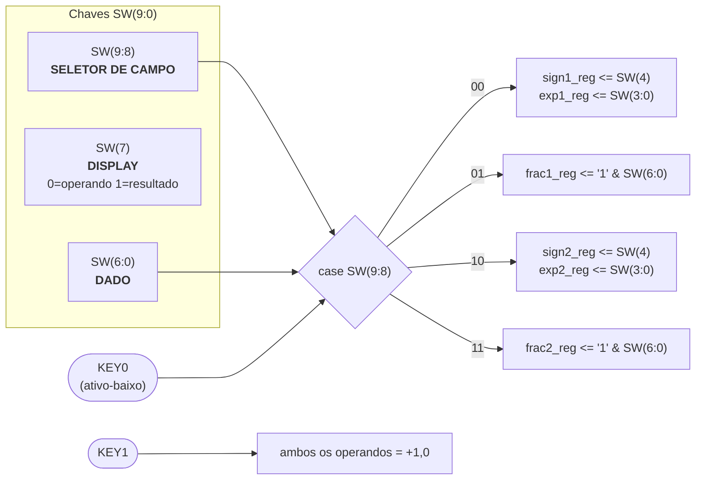
```mermaid
flowchart LR
    subgraph SW["Chaves SW(9:0)"]
        direction TB
        S98["SW(9:8)<br/><b>SELETOR DE CAMPO</b>"]
        S7["SW(7)<br/><b>DISPLAY</b><br/>0=operando 1=resultado"]
        S60["SW(6:0)<br/><b>DADO</b>"]
    end

    S98 --> DEC{"case SW(9:8)"}
    S60 --> DEC
    K0(["KEY0<br/>(ativo-baixo)"]) --> DEC

    DEC --> |"00"| R1["sign1_reg &lt;= SW(4)<br/>exp1_reg &lt;= SW(3:0)"]
    DEC --> |"01"| R2["frac1_reg &lt;= '1' &amp; SW(6:0)"]
    DEC --> |"10"| R3["sign2_reg &lt;= SW(4)<br/>exp2_reg &lt;= SW(3:0)"]
    DEC --> |"11"| R4["frac2_reg &lt;= '1' &amp; SW(6:0)"]

    K1(["KEY1"]) --> RST["ambos os operandos = +1,0"]
```

| `SW(9:8)` | Campo carregado por `KEY0` | Bits de dado usados |
|---|---|---|
| `00` | sinal e expoente do **operando 1** | `SW(4)` = sinal, `SW(3:0)` = expoente |
| `01` | fração do **operando 1** | `frac = '1' & SW(6:0)` |
| `10` | sinal e expoente do **operando 2** | `SW(4)` = sinal, `SW(3:0)` = expoente |
| `11` | fração do **operando 2** | `frac = '1' & SW(6:0)` |

| Botão | Função | Observação |
|---|---|---|
| `KEY0` | carrega o campo apontado por `SW(9:8)` | ativo-baixo |
| `KEY1` | reinicia ambos os operandos em `+1,0` | - |

### 3.5 Normalização da entrada

```vhdl
frac_in <= '1' & SW(6 downto 0);
```

O bit 7 da fração não é ajustável, assim é impossível digitar um operando
desnormalizado. Isso é relevante pois o primeiro estágio compara `exp & frac` como um inteiro
de 12 bits, e essa comparação só é válida se ambos os operandos estiverem normalizados. Com
entrada desnormalizada, o somador elege o operando errado como "maior", resultando em output incorreto.

### 3.6 Layout dos displays

```
   HEX5     HEX4     HEX3     HEX2     HEX1     HEX0
  ┌────┐   ┌────┐   ┌────┐   ┌────┐   ┌────┐   ┌────┐
  │ C  │   │    │   │ -  │   │ E. │   │ F  │   │ F  │
  └────┘   └────┘   └────┘   └────┘   └────┘   └────┘
   carry   apagado   sinal   expoente    fração (8 bits)
                                └── ponto SEMPRE aceso:
                                    marca a fronteira exp/frac
```

O `C` do `HEX5` é a letra inicial de **carry**: o vai-um do expoente, isto é, o bit que
sobrou quando `expb + 1` não coube nos 4 bits do campo.

| Display | Conteúdo | Fonte |
|---|---|---|
| `HEX5` | `C` de **carry**: o expoente estourou; apagado caso contrário | constante `SSEG_C` |
| `HEX4` | sempre apagado | - |
| `HEX3` | `-` quando o valor exibido é negativo | constante `SSEG_MENOS` |
| `HEX2` | expoente (0–F), com ponto decimal **sempre aceso** | `hex_to_sseg` |
| `HEX1` | fração, nibble alto | `hex_to_sseg` |
| `HEX0` | fração, nibble baixo | `hex_to_sseg` |

Exemplos de leitura:

```
   C _ -  0.  F  F     →   −(0xFF / 256) × 2^16  =  −65280
   _ _ _  5.  8  0     →    (0x80 / 256) × 2^5   =      16
```

| LED | Significado |
|---|---|
| `LEDR(9)` | sinal do resultado |
| `LEDR(8)` | carry do expoente (visível mesmo exibindo um operando) |
| `LEDR(7)` | display atual (aceso = resultado) |
| `LEDR(6:0)` | eco de `SW(6:0)` para conferencia do dado antes de carregar |

### 3.7 Detecção de estouro sem alterar o somador

O expoente tem 4 bits. Quando `expb = 15` e o vai-um dispara, `expn <= expb + 1` dá a volta
para `0`. Na conversa com a IA isso apareceu como `32640 + 32640` devolvendo `0,9961`.

A solução foi **deduzir o estouro de fora**, observando apenas os sinais já disponíveis, sem
alterar o `fp_adder`:

```vhdl
ovf <= '1' when sign1_reg = sign2_reg
                and (exp1_reg = "1111" or exp2_reg = "1111")
                and exp_out = "0000"
       else '0';
```

**Raciocínio:** com sinais iguais não há subtração, então `exp_out` só pode valer `expb` ou
`expb + 1`. Se `expb = 15`, o incremento dá a volta e sai `0`. Esse valor é impossível por
qualquer outro caminho quando `expb = 15`, porque o ramo geral calcula `expb − leado`, e com
`leado ≤ 7` isso nunca desce abaixo de 8. Como a ordenação coloca o maior expoente em `expb`,
testar `exp1 = 15 or exp2 = 15` equivale a testar `expb = 15`.

Quando `ovf` está ativo, o `C` aparece no `HEX5` e o expoente real é 16.

### 3.8 Pinagem

A pinagem é importada do arquivo oficial da Terasic via *Assignments → Import Assignments → `fp_adder/DE10_LITE.qsf`*.

| Sinal | Pinos (extrato) |
|---|---|
| `MAX10_CLK1_50` | `PIN_P11` |
| `KEY[0]`, `KEY[1]` | `PIN_B8`, `PIN_A7` |
| `SW[0]`..`SW[9]` | `PIN_C10`, `C11`, `D12`, `C12`, `A12`, `B12`, `A13`, `A14`, `B14`, `F15` |
| `LEDR[0]`..`LEDR[9]` | `PIN_A8`, `A9`, `A10`, `B10`, `D13`, `C13`, `E14`, `D14`, `A11`, `B11` |
| `HEX0[0..7]` | `PIN_C14`, `E15`, `C15`, `C16`, `E16`, `D17`, `C17`, `D15` |
| `HEX1`..`HEX5` | idem, conforme `DE10_LITE.qsf` |

Configuração do projeto: família **MAX 10**, dispositivo **`10M50DAF484C7G`**, entidade topo
**`fp_adder_demo`**, Quartus Prime **25.1std Lite**.

---

## 4. Evidências de Validação

### 4.1 Como reproduzir a simulação

Todo o fluxo de simulação é executado numa máquina Windows com Quartus Prime 25.1std Lite +
Questa. De dentro da pasta `fp_adder/`, no prompt do Questa:

```tcl
do sim_demo.do
```

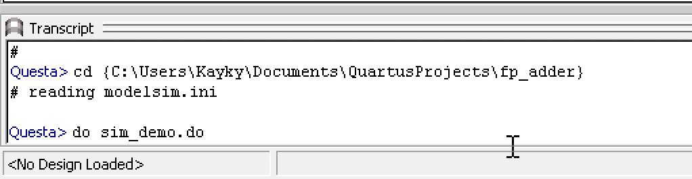

*Invocação do script no Transcript, a partir da pasta do projeto.*

A execução completa, da compilação ao veredito final:


*Compilação, elaboração, montagem da janela Wave e o transcript rolando até
`RESULTADO: todos os testes passaram.`*

O script:

1. recria a biblioteca `work`;
2. compila **nesta ordem obrigatória** (`vcom -2008`):
   `fp_adder.vhd` → `hex_to_sseg.vhd` → `fp_adder_demo.vhd` → `fp_adder_demo_tb.vhd`;
3. elabora com `vsim -voptargs=+acc` — **sem o `+acc`** o otimizador do Questa descarta
   `expb`, `exps`, `fraca`, `sum`, `leado` e `sum_norm`, e os `add wave` dos sinais internos
   falham **em silêncio**, sem mensagem de erro;
4. define um **radix customizado `sseg`**, que mostra na waveform o *dígito que aparece no
   display* em vez do padrão de bits dos segmentos;
5. roda até o fim e dá zoom na janela.

Ao término, o Questa apresenta a janela Wave já organizada pelos divisores definidos no
script — entradas da placa, displays, operandos registrados, estágios internos do somador,
resultado e LEDs:

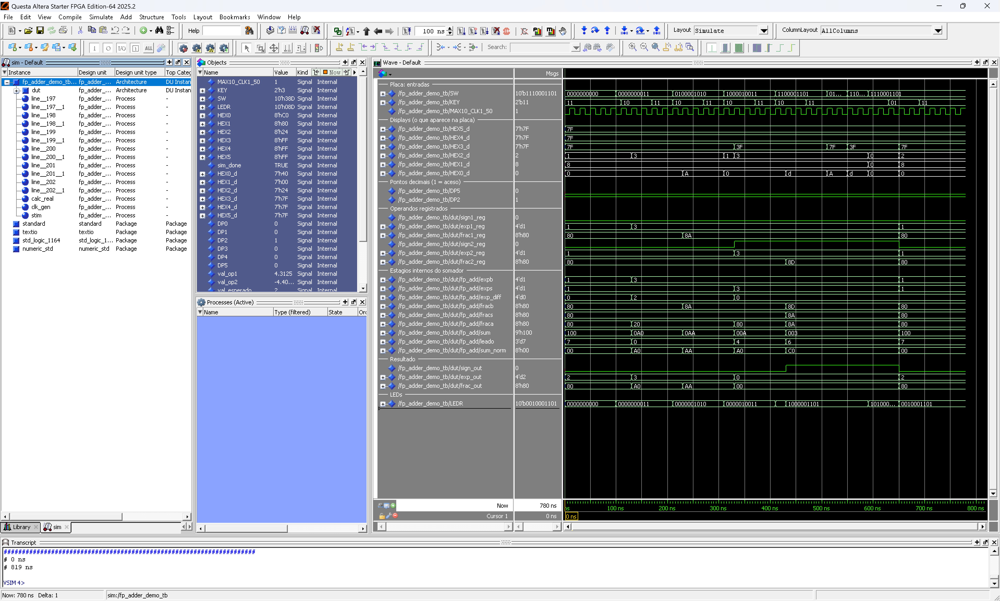

*Simulação completa, 780 ns. Os divisores agrupam os sinais por papel, e o radix `sseg`
converte os padrões de segmento no dígito exibido.*

### 4.2 Estratégia do testbench

O `fp_adder_demo_tb.vhd` calcula sozinho o valor esperado de cada caso e o compara com o que
o circuito produziu, imprimindo `[ OK ]` ou `[ FALHOU ]` e um veredito final no transcript —
não é preciso inspecionar as formas de onda para saber se passou.

A comparação não usa os sinais internos do resultado: o testbench lê os seis displays de sete
segmentos e os decodifica de volta para nibbles (função `sseg_to_nib`), reconstruindo o número
exibido.

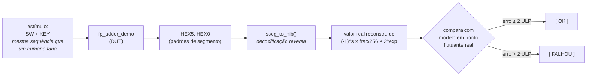
```mermaid
flowchart LR
    E["estímulo:<br/>SW + KEY<br/><i>mesma sequência que<br/>um humano faria</i>"] --> D["fp_adder_demo<br/>(DUT)"]
    D --> H["HEX5..HEX0<br/>(padrões de segmento)"]
    H --> R["sseg_to_nib()<br/><i>decodificação reversa</i>"]
    R --> V["valor real reconstruído<br/>(-1)^s × frac/256 × 2^exp"]
    V --> C{"compara com<br/>modelo em ponto<br/>flutuante real"}
    C --> |"erro ≤ 2 ULP"| OK["[ OK ]"]
    C --> |"erro > 2 ULP"| F["[ FALHOU ]"]
```

Isso valida **o caminho completo**, incluindo o decodificador e a montagem dos displays — um
erro na tabela de segmentos seria pego. O testbench também confere o display de cada operando
(`SW(7) = '0'`) antes de olhar o resultado, garantindo que o protocolo de carga funcionou.

Sinais do tipo `real` (`val_op1`, `val_op2`, `val_esperado`, `val_placa`, `val_erro`) existem
exclusivamente para leitura decimal direta na janela Wave — não participam da verificação.

**Critério de aprovação:** tolerância de 2 ULP, isto é `2 × 2^exp / 256`. Truncamento ocorre
em dois pontos (alinhamento e deslocamento do vai-um), ambos sempre na mesma direção. Para
resultados abaixo do mínimo normalizável (`|valor| < 0,5`), o critério passa a ser
`frac = 0` exato.

Cada caso imprime os dois operandos, o valor esperado, a foto dos seis displays, o valor lido
de volta a partir deles e o veredito. Ao final, o testbench consolida o resultado geral:

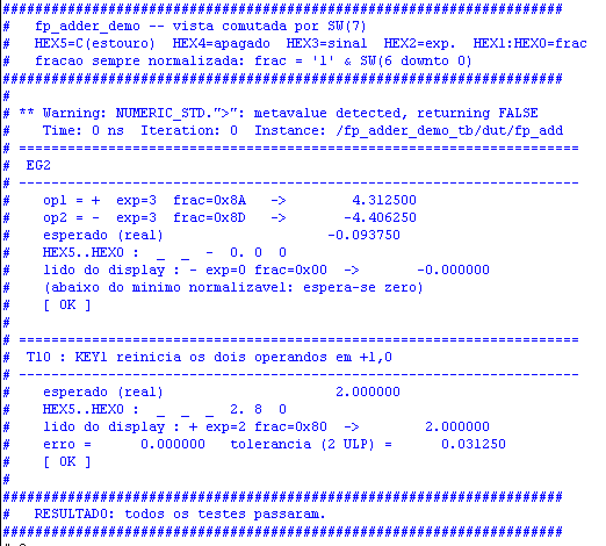

*Trecho final do transcript: o caso `EG2`, o autoteste do reset e a linha
`RESULTADO: todos os testes passaram.`*

### 4.3 Casos de teste

Os quatro primeiros casos vêm diretamente da Table 1 do livro (§3.7.4), traduzidos para
binário **mantendo o expoente e escolhendo a fração normalizada mais próxima**:

| Decimal | Fração binária | Valor exato | Erro |
|---|---|---|---|
| 0.54 | `0x8A` = 138 | 0,5390625 | 9,38 × 10⁻⁴ |
| 0.87 | `0xDF` = 223 | 0,87109375 | 1,09 × 10⁻³ |
| 0.55 | `0x8D` = 141 | 0,55078125 | 7,81 × 10⁻⁴ |
| 0.56 | `0x8F` = 143 | 0,55859375 | 1,41 × 10⁻³ |
| 0.52 | `0x85` = 133 | 0,51953125 | 4,69 × 10⁻⁴ |

| Teste | Entrada | Caso de normalização | Comportamento esperado |
|---|---|---|---|
| **EG1** | `+0.54E3 + (−0.87E4)` | **I** — sem ajuste | subtrai após alinhar 1 casa, permanece em E4 |
| **EG2** | `+0.54E3 + (−0.55E3)` | **III** — vira zero | cancelamento quase total; precisa de 6 bits de deslocamento e só há 3 de expoente |
| **EG3** | `+0.54E0 + (−0.55E0)` | **III** — vira zero | expoente no mínimo; equivale ao `−0.00E0` do livro |
| **EG4** | `+0.56E3 + (+0.52E3)` | **IV** — vai-um | soma estoura 8 bits, expoente sobe para E4 |

A Table 1 não alcança todos os ramos do circuito — falta o caso II da normalização, o
alinhamento saturado e o estouro do expoente. Seis casos complementares cobrem essas lacunas:

| Teste | Entrada | O que exercita | Resultado esperado |
|---|---|---|---|
| **T5** | `+0.54E6 + (−0.55E6)` | **caso II** — deslocamento à esquerda pago pelo expoente | mesmo par do EG2 com expoente sobrando: `leado = 6` e `expb = 6`, renormaliza para **−0,75 exato** |
| **T6** | `1,0 + 0,5` | potências de dois | **1,5 exato** — só representável porque apenas o bit 7 é forçado (§3.5) |
| **T7** | `−24 + 4` | ordenação com o **operando 1** maior | subtrai e preserva o sinal do maior: **−20 exato** |
| **T8** | `16384 + 0,996` | alinhamento saturado (`exp_diff = 15`) | a fração do menor é deslocada além dos 8 bits e some: **16384** |
| **T9** | `a + (−a)` com `exp = 12` | cancelamento total com `expb ≥ 7` | zero com **expoente 5** — o zero não canônico, limitação conhecida do somador |
| **T10** | `32640 + 32640` | **estouro do expoente** | `expn = 15 + 1` dá a volta; `HEX5` acende `C` e o valor lido é **65280** |
| **T11** | `KEY1` (reinício) | autoteste do reset | `+1,0 + 1,0 = 2,0` exato |


### 4.4 Formas de onda — o 4º estágio (normalização)

As capturas abaixo vêm da janela Wave do Questa, com o cursor posicionado ao fim de cada caso.
Os sinais relevantes estão no divisor **"Estagios internos do somador"** — `expb`, `exps`,
`exp_diff`, `fracb`, `fracs`, `fraca`, `sum`, `leado`, `sum_norm` — mais `exp_out` e
`frac_out` no divisor "Resultado".

**Caso I — sem ajuste (EG1):** `sum(8)=0`, `leado=0`, resultado sai como está.

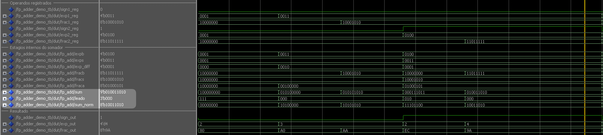

*`+0.54E3 + (−0.87E4)`. Cursor no fim do caso.*

Os quatro estágios, lidos na captura:

| Estágio | Sinais | Leitura |
|---|---|---|
| **1 · ordenar** | `expb=0100`, `exps=0011`, `fracb=11011111`, `fracs=10001010` | o operando 2 (`E4`, `0xDF`) é o maior e vai para `b` |
| **2 · alinhar** | `exp_diff=0001`, `fraca=01000101` | `0x8A` desloca 1 casa à direita e vira `0x45` |
| **3 · subtrair** | `sum=010011010` | sinais opostos: `0xDF − 0x45 = 0x9A`, sem vai-um |
| **4 · normalizar** | `leado=000`, `sum_norm=10011010` | o bit 7 de `0x9A` já está aceso, nada a deslocar |

Resultado: `sign_out=1`, `exp_out=4'd4`, `frac_out=8'h9A` — ou seja
$-(154/256) \times 2^{4} = -9{,}625$, o valor exato da soma.

**Caso III — resultado pequeno demais:** `leado > expb`. Dois testes chegam aqui por caminhos
diferentes, e vale ver os dois.

**EG2 — `+0.54E3 + (−0.55E3)`:** o expoente não está no mínimo, mas continua insuficiente —
3 unidades para uma dívida de 6.

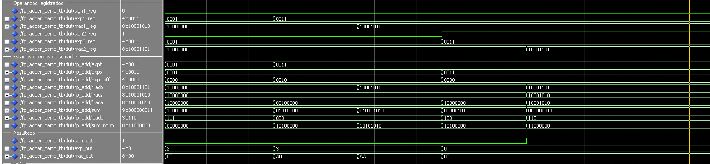

*Ambos os operandos em `E3`, cursor no fim do caso.*

| Estágio | Sinais | Leitura |
|---|---|---|
| **1 · ordenar** | `expb=exps=0011`, `fracb=10001101`, `fracs=10001010` | expoentes iguais, decide a fração: `0x8D > 0x8A` |
| **2 · alinhar** | `exp_diff=0000`, `fraca=10001010` | diferença zero, nada a deslocar |
| **3 · subtrair** | `sum=000000011` | `0x8D − 0x8A = 3`, valor correto e desnormalizado |
| **4 · normalizar** | `leado=110` (6), `sum_norm=11000000` | seis zeros à esquerda; o deslocador produz `0xC0` |

E é aqui que o resultado se perde: `leado = 6` é maior que `expb = 3`, então o ramo do
descarte assume e a saída vai a `exp_out = 4'd0`, `frac_out = 8'h00`.

O `sum_norm = 0xC0` visível na captura **é a resposta certa** — com expoente `3 − 6 = −3`
valeria exatamente `−0,09375`. O deslocador fez seu trabalho; o que faltou foi expoente para
pagar o deslocamento, e o formato não representa expoente negativo. `sign_out = 1` permanece,
produzindo um zero negativo.

**EG3 — `+0.54E0 + (−0.55E0)`:** o caso literal do livro (`eg. 3`, `−0.01E0 → −0.00E0`), com
o expoente já no mínimo.

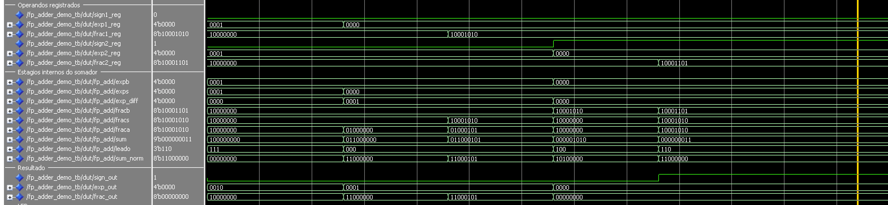

*Ambos os operandos em `E0`, cursor no fim do caso.*

Comparando com a captura do EG2, **muda apenas o `expb`** — `0000` no lugar de `0011`. Os
estágios 1 a 3 produzem exatamente os mesmos valores (`exp_diff=0000`, `fracb=10001101`,
`fraca=10001010`, `sum=000000011`), e o quarto estágio também: `leado=110`,
`sum_norm=11000000`. A saída é a mesma: `exp_out=0000`, `frac_out=00000000`, `sign_out=1`.

Os dois casos convergem para o mesmo lugar por motivos de intensidade diferente — no EG2
faltavam 3 unidades de expoente, aqui faltam 6. **O descarte não depende de quão pequeno é o
resultado, e sim de quanto expoente sobrou para pagar a normalização.**

**Caso IV — vai-um (EG4):** `sum(8)='1'`.

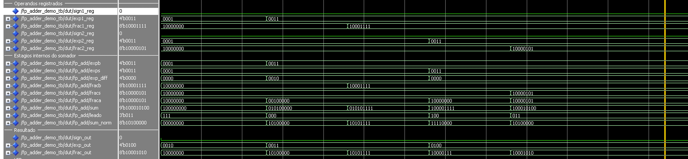

*`+0.56E3 + (+0.52E3)`. Ambos os operandos em `E3` e com o mesmo sinal, cursor no fim do caso.*

| Estágio | Sinais | Leitura |
|---|---|---|
| **1 · ordenar** | `expb=exps=0011`, `fracb=10001111`, `fracs=10000101` | expoentes iguais, `0x8F > 0x85` |
| **2 · alinhar** | `exp_diff=0000`, `fraca=10000101` | nada a deslocar |
| **3 · somar** | `sum=100010100` | sinais iguais: `0x8F + 0x85 = 0x114` — **o nono bit acendeu** |
| **4 · normalizar** | ramo do vai-um | `expn = 3 + 1 = 4`, `fracn = sum(8 downto 1) = 0x8A` |

Saída: `sign_out=0`, `exp_out=0100`, `frac_out=10001010`, isto é
$(138/256) \times 2^{4} = 8{,}625$ — exato.

Vale reparar que `leado = 011` e `sum_norm = 10100000` também aparecem calculados na captura,
e são **ignorados**: o `if sum(8) = '1'` tem prioridade sobre os demais ramos. Os três
segmentos do quarto estágio operam sempre em paralelo, e só o último decide qual resultado
sobrevive.

**Caso II — deslocamento à esquerda (T5, `E6`):** `leado > 0` e `leado ≤ expb`. É o caso que
responde ao ponto de observação da Etapa 1 — o circuito conta os zeros e desloca à esquerda,
descontando o expoente na medida certa.

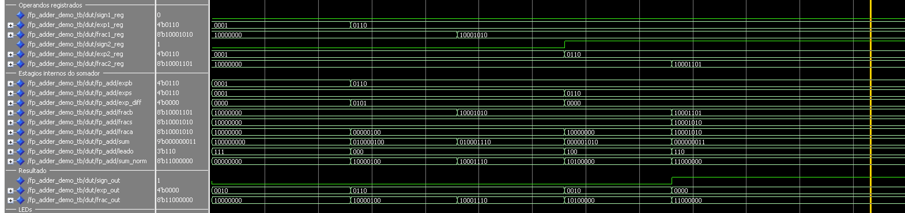

*`+0.54E6 + (−0.55E6)`. As mesmas frações do EG2 e do EG3, agora em `E6`.*

| Estágio | Sinais | Leitura |
|---|---|---|
| **1 · ordenar** | `expb=exps=0110`, `fracb=10001101`, `fracs=10001010` | expoentes iguais, `0x8D > 0x8A` |
| **2 · alinhar** | `exp_diff=0000`, `fraca=10001010` | nada a deslocar |
| **3 · subtrair** | `sum=000000011` | `0x8D − 0x8A = 3` |
| **4 · normalizar** | `leado=110` (6), `sum_norm=11000000` | `6 ≤ 6`: o deslocamento **é pago** |

Saída: `exp_out=0000` (`6 − 6`), `frac_out=11000000`, `sign_out=1`, ou seja
$-(192/256) \times 2^{0} = -0{,}75$ — exato.

Comparando as três capturas do mesmo par de frações:

| Teste | `expb` | `leado` | `sum_norm` | Saída |
|---|---|---|---|---|
| EG3 | 0 | 6 | `0xC0` | descartado → zero |
| EG2 | 3 | 6 | `0xC0` | descartado → zero |
| **T5** | **6** | 6 | `0xC0` | **aproveitado** → `exp=0`, `frac=0xC0` |

Os estágios 1 a 3 produzem valores idênticos nos três, e o `sum_norm` correto é calculado nos
três. **A única variável é quanto expoente havia para gastar.**

**Visão geral da simulação completa.** Os onze casos foram exportados do VCD para WaveDrom
pelo script [`tools/vcd_to_wavedrom.py`](tools/vcd_to_wavedrom.py), que produz um bloco por
caso mais um panorama contínuo:

| Artefato | Conteúdo |
|---|---|
| [`debug/sim_demo.vcd`](debug/sim_demo.vcd) | o dump da simulação exportado do Questa — origem de tudo abaixo |
| [`img/wavedrom-todos.png`](img/wavedrom-todos.png) | os onze casos em sequência, `EG1` a `T11` |
| [`debug/wavedrom/ondas.md`](debug/wavedrom/ondas.md) | um bloco WaveDrom por caso, pronto para colar no editor |
| [`debug/wavedrom/*.json`](debug/wavedrom/) | as fontes individuais (`EG1.json`, …, `T11.json`) |

A conversão é reproduzível:

```bash
python3 tools/vcd_to_wavedrom.py debug/sim_demo.vcd -o debug/wavedrom
```

A imagem consolidada tem cerca de 22000 px de largura — abrir em tamanho real, já que
reduzida à largura da página ela fica ilegível. Para leitura caso a caso, os `.json`
individuais rendem diagramas na proporção certa.

### 4.5 Transcript da simulação

Saída completa de `do sim_demo.do`, com os onze casos e o veredito final. O arquivo bruto está
em [`transcript_questa.txt`](transcript_questa.txt).

```
#####################################################################
#   fp_adder_demo -- vista comutada por SW(7)
#   HEX5=C(estouro)  HEX4=apagado  HEX3=sinal  HEX2=exp.  HEX1:HEX0=frac
#   fracao sempre normalizada: frac = '1' & SW(6 downto 0)
#####################################################################
# 
# ** Warning: NUMERIC_STD.">": metavalue detected, returning FALSE
#    Time: 0 ns  Iteration: 0  Instance: /fp_adder_demo_tb/dut/fp_add
# =====================================================================
#  EG1 : +0.54E3 + (-0.87E4)   alinha 1 casa, subtrai, fica em E4
# ---------------------------------------------------------------------
#    op1 = +  exp=3  frac=0x8A   ->        4.312500
#    op2 = -  exp=4  frac=0xDF   ->      -13.937500
#    esperado (real)                    -9.625000
#    HEX5..HEX0 :  _  _  -  4. 9  A  
#    lido do display : - exp=4 frac=0x9A  ->       -9.625000
#    erro =      0.000000   tolerancia (2 ULP) =      0.125000
#    [ OK ]
# 
# =====================================================================
#  EG2 : +0.54E3 + (-0.55E3)   cancelamento: precisa de 6 bits, so ha 3 de expoente
# ---------------------------------------------------------------------
#    op1 = +  exp=3  frac=0x8A   ->        4.312500
#    op2 = -  exp=3  frac=0x8D   ->       -4.406250
#    esperado (real)                    -0.093750
#    HEX5..HEX0 :  _  _  -  0. 0  0  
#    lido do display : - exp=0 frac=0x00  ->       -0.000000
#    (abaixo do minimo normalizavel: espera-se zero)
#    [ OK ]
# 
# =====================================================================
#  EG3 : +0.54E0 + (-0.55E0)   expoente no minimo, vira zero negativo
# ---------------------------------------------------------------------
#    op1 = +  exp=0  frac=0x8A   ->        0.539062
#    op2 = -  exp=0  frac=0x8D   ->       -0.550781
#    esperado (real)                    -0.011719
#    HEX5..HEX0 :  _  _  -  0. 0  0  
#    lido do display : - exp=0 frac=0x00  ->       -0.000000
#    (abaixo do minimo normalizavel: espera-se zero)
#    [ OK ]
# 
# =====================================================================
#  EG4 : +0.56E3 + (+0.52E3)   vai-um, expoente sobe para E4
# ---------------------------------------------------------------------
#    op1 = +  exp=3  frac=0x8F   ->        4.468750
#    op2 = +  exp=3  frac=0x85   ->        4.156250
#    esperado (real)                     8.625000
#    HEX5..HEX0 :  _  _  _  4. 8  A  
#    lido do display : + exp=4 frac=0x8A  ->        8.625000
#    erro =      0.000000   tolerancia (2 ULP) =      0.125000
#    [ OK ]
# 
# =====================================================================
#  T5  : +0.54E6 + (-0.55E6)   expoente suficiente: renormaliza para -0,75
# ---------------------------------------------------------------------
#    op1 = +  exp=6  frac=0x8A   ->       34.500000
#    op2 = -  exp=6  frac=0x8D   ->      -35.250000
#    esperado (real)                    -0.750000
#    HEX5..HEX0 :  _  _  -  0. C  0  
#    lido do display : - exp=0 frac=0xC0  ->       -0.750000
#    erro =      0.000000   tolerancia (2 ULP) =      0.007812
#    [ OK ]
# 
# =====================================================================
#  T6  : 1,0 + 0,5             potencias de dois, resultado exato 1,5
# ---------------------------------------------------------------------
#    op1 = +  exp=1  frac=0x80   ->        1.000000
#    op2 = +  exp=0  frac=0x80   ->        0.500000
#    esperado (real)                     1.500000
#    HEX5..HEX0 :  _  _  _  1. C  0  
#    lido do display : + exp=1 frac=0xC0  ->        1.500000
#    erro =      0.000000   tolerancia (2 ULP) =      0.015625
#    [ OK ]
# 
# =====================================================================
#  T7  : -24 + 4               operando 1 e o maior, subtrai e mantem o sinal
# ---------------------------------------------------------------------
#    op1 = -  exp=5  frac=0xC0   ->      -24.000000
#    op2 = +  exp=3  frac=0x80   ->        4.000000
#    esperado (real)                   -20.000000
#    HEX5..HEX0 :  _  _  -  5. A  0  
#    lido do display : - exp=5 frac=0xA0  ->      -20.000000
#    erro =      0.000000   tolerancia (2 ULP) =      0.250000
#    [ OK ]
# 
# =====================================================================
#  T8  : 16384 + 0,996         exp_diff=15, o operando pequeno e absorvido
# ---------------------------------------------------------------------
#    op1 = +  exp=15  frac=0x80   ->    16384.000000
#    op2 = +  exp=0  frac=0xFF   ->        0.996094
#    esperado (real)                 16384.996094
#    HEX5..HEX0 :  _  _  _  F. 8  0  
#    lido do display : + exp=15 frac=0x80  ->    16384.000000
#    erro =      0.996094   tolerancia (2 ULP) =    256.000000
#    [ OK ]
# 
# =====================================================================
#  T9  : a + (-a) com exp=12   cancelamento total: zero com expoente 5
# ---------------------------------------------------------------------
#    op1 = +  exp=12  frac=0xC0   ->     3072.000000
#    op2 = -  exp=12  frac=0xC0   ->    -3072.000000
#    esperado (real)                     0.000000
#    HEX5..HEX0 :  _  _  -  5. 0  0  
#    lido do display : - exp=5 frac=0x00  ->       -0.000000
#    (abaixo do minimo normalizavel: espera-se zero)
#    [ OK ]
# 
# =====================================================================
#  T10 : 32640 + 32640         ESTOURO do expoente, HEX5 mostra C
# ---------------------------------------------------------------------
#    op1 = +  exp=15  frac=0xFF   ->    32640.000000
#    op2 = +  exp=15  frac=0xFF   ->    32640.000000
#    esperado (real)                 65280.000000
#    HEX5..HEX0 :  C  _  _  0. F  F  
#    lido do display : + exp=16 (C aceso: 0+16) frac=0xFF  ->    65280.000000
#    erro =      0.000000   tolerancia (2 ULP) =    512.000000
#    [ OK ]
# 
# =====================================================================
#  T11 : KEY1 reinicia os dois operandos em +1,0
# ---------------------------------------------------------------------
#    esperado (real)                     2.000000
#    HEX5..HEX0 :  _  _  _  2. 8  0  
#    lido do display : + exp=2 frac=0x80  ->        2.000000
#    erro =      0.000000   tolerancia (2 ULP) =      0.031250
#    [ OK ]
# 
#####################################################################
#   RESULTADO: todos os testes passaram.
#####################################################################
```

O warning `NUMERIC_STD.">": metavalue detected` em `t = 0` é esperado e inofensivo: `leado`
ainda vale `UUU` no primeiro delta, antes de qualquer estímulo chegar ao circuito.

---

### 4.6 Código VHDL Final

Os arquivos são a fonte da verdade e estão versionados no repositório:

| Arquivo | Papel | Estado |
|---|---|---|
| [`fp_adder/fp_adder.vhd`](fp_adder/fp_adder.vhd) | somador de 4 estágios — Listing 3.19 do livro | **não modificado** (só indentação e comentários de seção) |
| [`fp_adder/hex_to_sseg.vhd`](fp_adder/hex_to_sseg.vhd) | decodificador de sete segmentos | reaproveitado do Lab 3; a codificação da DE10-Lite coincide com a do livro |
| [`fp_adder/fp_adder_demo.vhd`](fp_adder/fp_adder_demo.vhd) | **entidade topo — a adaptação** | reescrito para a DE10-Lite |
| [`fp_adder/fp_adder_demo_tb.vhd`](fp_adder/fp_adder_demo_tb.vhd) | testbench, 11 casos | novo |
| [`fp_adder/sim_demo.do`](fp_adder/sim_demo.do) | script de simulação do Questa | novo |

Todo o trabalho de adaptação vive no `fp_adder_demo.vhd`; os quatro trechos que o resumem
estão destacados a seguir.

#### 4.6.1 Trechos-chave da adaptação

**(A) Normalização da entrada** *(§3.5)*

```vhdl
frac_in <= '1' & SW(6 downto 0);
```

Uma linha que torna impossível violar a precondição do primeiro estágio.

**(B) Multiplexação de entrada por campo** *(§3.4)*

```vhdl
if KEY(0) = '0' then
    case SW(9 downto 8) is
        when "00" =>  sign1_reg <= SW(4);  exp1_reg <= SW(3 downto 0);
        when "01" =>  frac1_reg <= frac_in;
        when "10" =>  sign2_reg <= SW(4);  exp2_reg <= SW(3 downto 0);
        when others => frac2_reg <= frac_in;
    end case;
end if;
```

Resolve o gargalo de 26 bits em 10 chaves sem debounce, porque a escrita é idempotente.

**(C) Detecção de estouro fora do somador** *(§3.7)*

```vhdl
ovf <= '1' when sign1_reg = sign2_reg
                and (exp1_reg = "1111" or exp2_reg = "1111")
                and exp_out = "0000"
       else '0';
```

Recupera informação que o somador perdeu, sem alterar uma linha sequer da Listing 3.19.

**(D) Padrões de display fora da tabela do decodificador** *(§2.4)*

```vhdl
constant SSEG_APAGADO : std_logic_vector(7 downto 0) := "1" & "1111111";
constant SSEG_MENOS   : std_logic_vector(7 downto 0) := "1" & "0111111";
constant SSEG_C       : std_logic_vector(7 downto 0) := "1" & "0100111";
```

Escolhidos por serem **inimitáveis** por qualquer valor válido — sinalização sem ambiguidade.

---

*Etapa 3*

### 4.7 Funcionamento na Placa

#### Procedimento de gravação

1. Abrir `fp_adder/fp_adder.qpf` no Quartus Prime 25.1std Lite.
2. *Assignments → Import Assignments…* → selecionar `fp_adder/DE10_LITE.qsf`.
   **Este passo é obrigatório** — o `.qsf` do projeto não contém pinagem.
3. Conferir *Assignments → Device*: família **MAX 10**, dispositivo **`10M50DAF484C7G`**.
4. *Processing → Start Compilation*.
5. *Tools → Programmer* → USB-Blaster → carregar `output_files/fp_adder.sof` → *Start*.

#### Estado inicial

Logo após a gravação, ambos os operandos valem `+1,0` e os displays mostram o resultado da
soma de reinício:

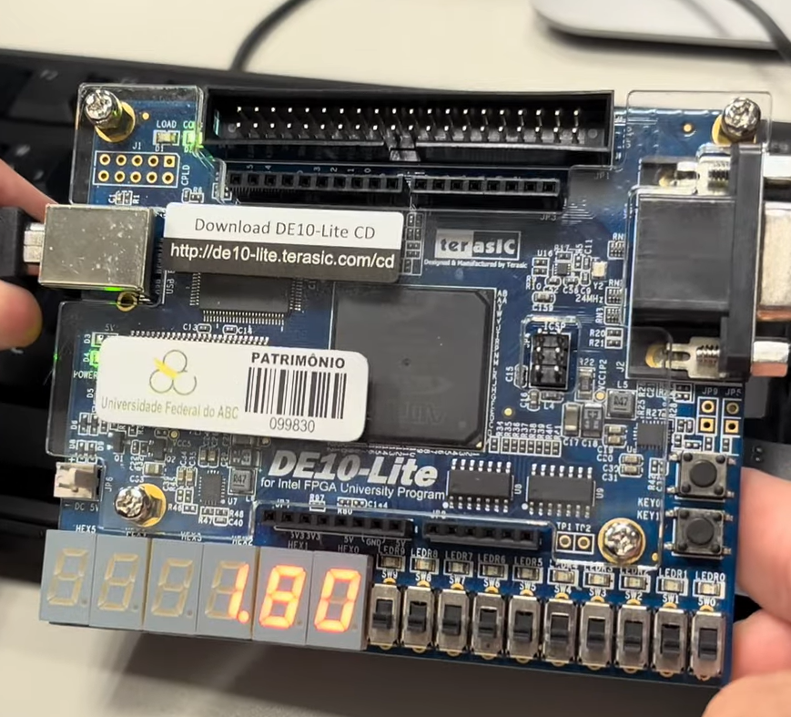

`_ _ _ 1. 8 0` — expoente 1, fração `0x80`. Todas as chaves em repouso.

#### Casos demonstrados

Na bancada exercitamos **dois casos**, escolhidos por cobrirem os dois extremos do
comportamento: uma soma comum, com alinhamento e sem vai-um, e o estouro do expoente, que é o
único ponto em que o formato de saída não fecha.

O vídeo completo da demonstração está em
<https://www.youtube.com/watch?v=FCv_n_XdVJw>.

---

**Caso 1 — estouro do expoente: `−32640 + (−32640) = −65280`**

Os dois operandos no extremo negativo da faixa: sinal negativo, expoente `F`, fração `0xFF`.

| Passo | `SW(9:8)` | `SW(6:0)` | Ação | Campo carregado |
|---|---|---|---|---|
| 1 | `00` | `0011111` | `KEY0` | op1: sinal `−`, expoente 15 |
| 2 | `01` | `1111111` | `KEY0` | op1: fração `0xFF` |
| 3 | `10` | `0011111` | `KEY0` | op2: sinal `−`, expoente 15 |
| 4 | `11` | `1111111` | `KEY0` | op2: fração `0xFF` |
| 5 | — | — | `SW(7) = 1` | mostra o resultado |

<table>
<tr>
<td width="50%">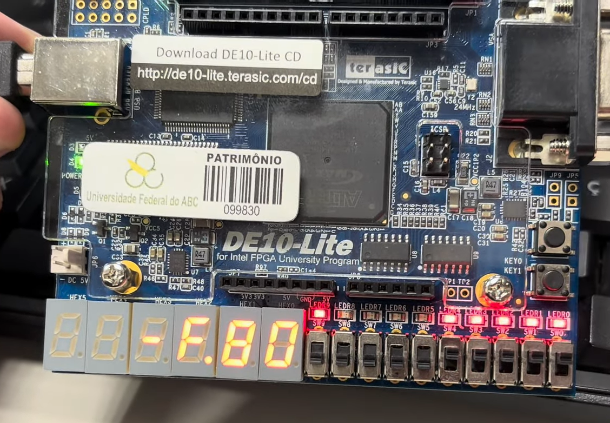</td>
<td width="50%">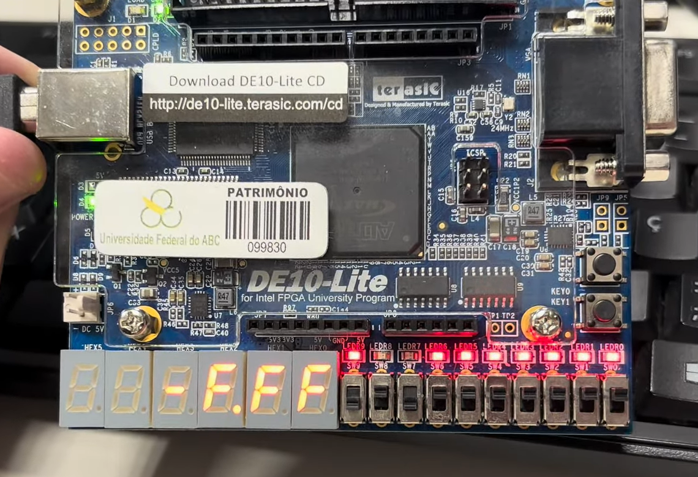</td>
</tr>
<tr>
<td><b>Passo 1</b> — <code>- F. 8 0</code><br>sinal e expoente do op1 carregados; a fração ainda é a de reinício</td>
<td><b>Passo 2</b> — <code>- F. F F</code><br>op1 completo: <b>−32640</b></td>
</tr>
<tr>
<td>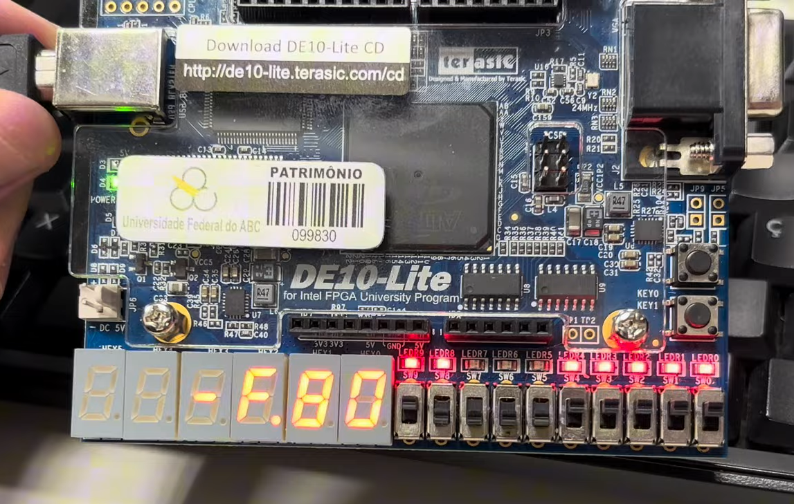</td>
<td>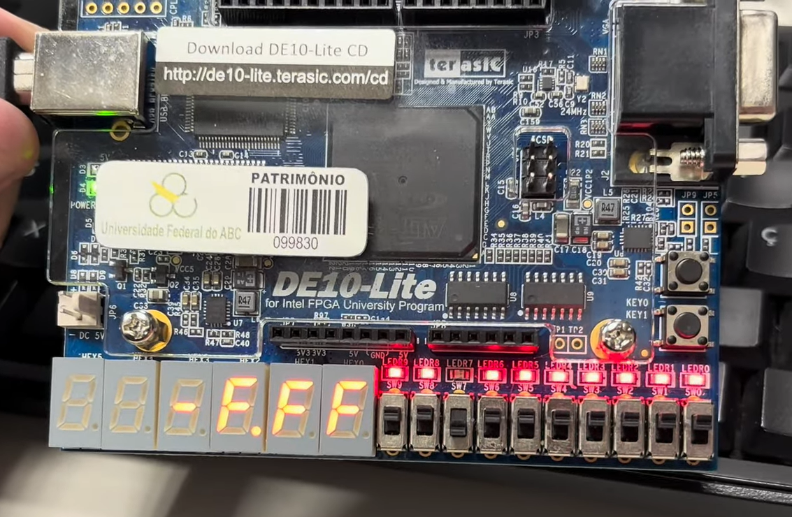</td>
</tr>
<tr>
<td><b>Passo 3</b> — <code>- F. 8 0</code><br>agora o display segue o op2, porque <code>SW(9) = 1</code></td>
<td><b>Passo 4</b> — <code>- F. F F</code><br>op2 completo: <b>−32640</b></td>
</tr>
</table>

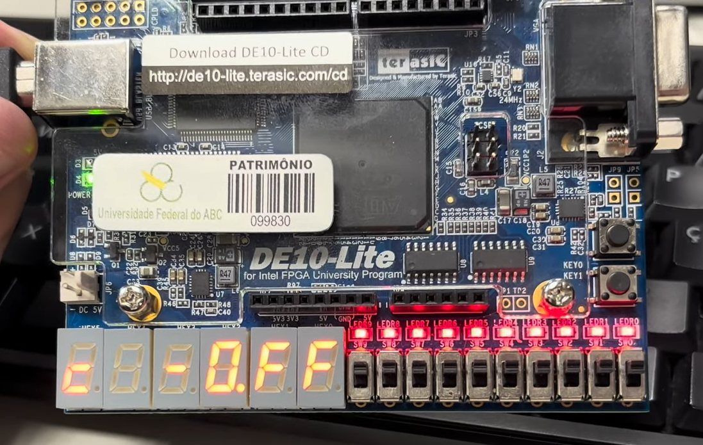

**Passo 5 — `C _ - 0. F F`.** O `C` no `HEX5` indica que o expoente estourou; `LEDR8` acende
junto. Com sinais iguais, `sum = 0xFF + 0xFF = 0x1FE` dispara o vai-um, então
`expn = 15 + 1 = 16` — que não cabe em 4 bits e sai como `0000`, enquanto a fração fica
`sum(8 downto 1) = 0xFF`. Com o `C` aceso o expoente real é 16, e a leitura é
$-(255/256) \times 2^{16} = -65280$.

É o mesmo mecanismo do **T10** da simulação (§4.3), aqui com os dois operandos negativos —
o `sign_out` acompanha o maior, e `LEDR9` acende.

---

**Caso 2 — soma com alinhamento: `2,5 + 1,0 = 3,5`**

| Passo | `SW(9:8)` | `SW(6:0)` | Ação | Campo carregado |
|---|---|---|---|---|
| 1 | `00` | `0000010` | `KEY0` | op1: sinal `+`, expoente 2 |
| 2 | `01` | `0100000` | `KEY0` | op1: fração `0xA0` |
| 3 | `10` / `11` | — | — | op2 mantido no valor de reinício `+1,0` |
| 4 | — | — | `SW(7) = 1` | mostra o resultado |

<table>
<tr>
<td width="50%">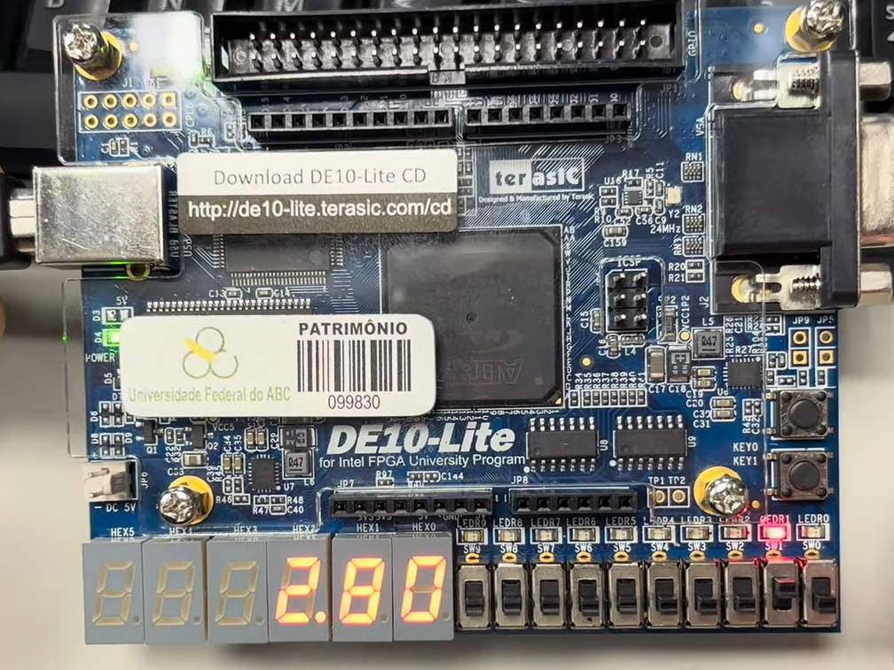</td>
<td width="50%">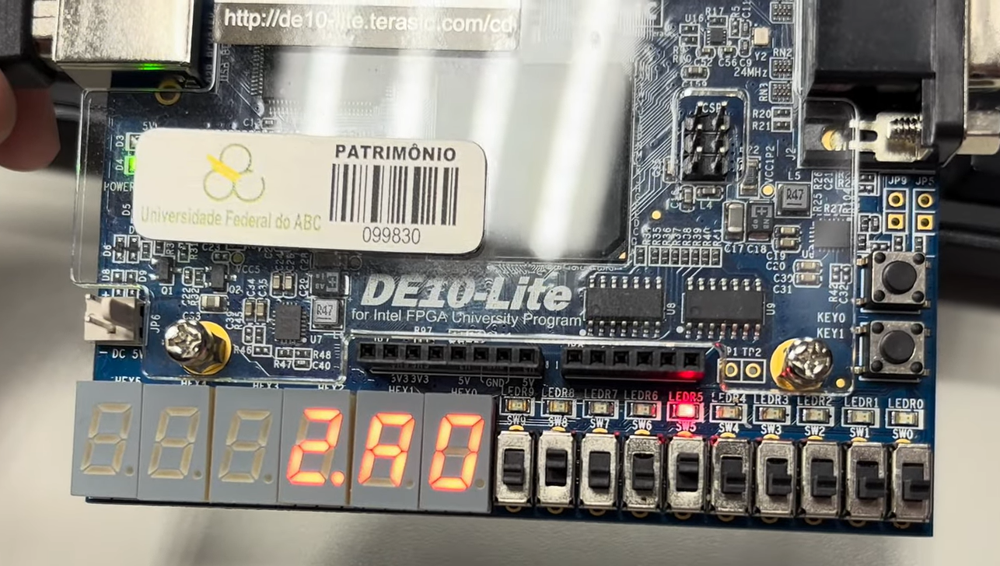</td>
</tr>
<tr>
<td><b>Passo 1</b> — <code>_ _ _ 2. 8 0</code><br>expoente 2, positivo</td>
<td><b>Passo 2</b> — <code>_ _ _ 2. A 0</code><br>op1 completo: <b>2,5</b></td>
</tr>
<tr>
<td>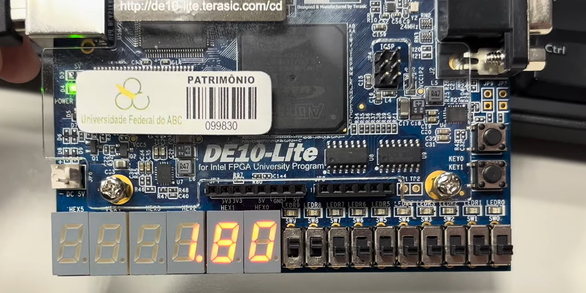</td>
<td>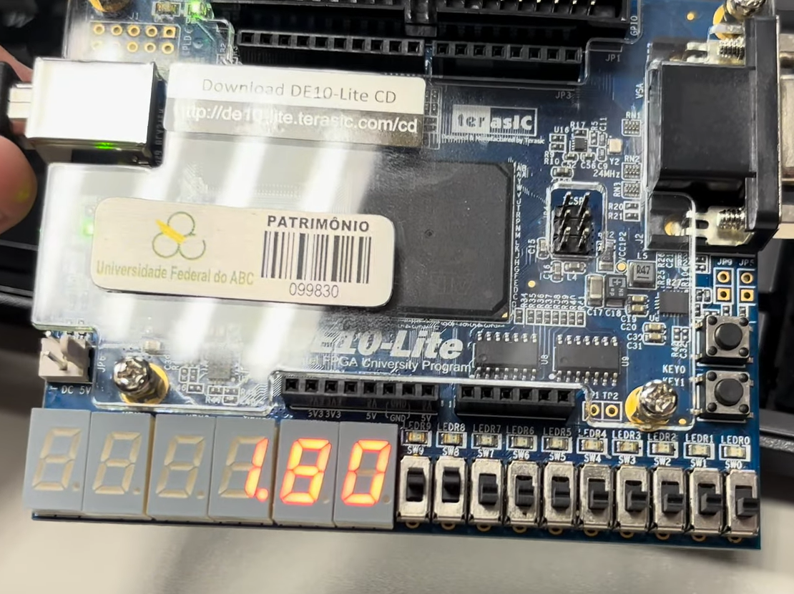</td>
</tr>
<tr>
<td colspan="2"><b>Passo 3</b> — <code>_ _ _ 1. 8 0</code> nas duas vistas: o operando 2 permanece em <b>+1,0</b>, o valor de reinício. As fotos conferem os dois campos antes de somar.</td>
</tr>
</table>

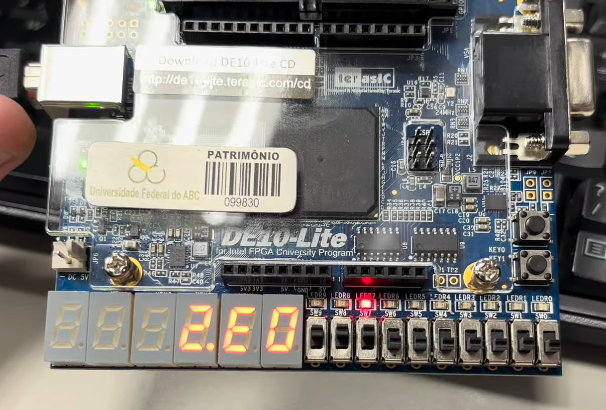

**Passo 4 — `_ _ _ 2. E 0`.** Percorrendo os estágios: a ordenação elege o op1 como maior
(`expb = 2`), o alinhamento desloca `0x80` uma casa à direita virando `0x40`, a soma dá
`0xA0 + 0x40 = 0xE0` sem estourar os 8 bits, e a normalização não tem o que fazer
(`leado = 0`). Leitura: $(224/256) \times 2^{2} = 3{,}5$ — exato.

---

*Etapa 4*

## 5. Diário de Bordo de IA

Usamos duas ferramentas, em fases distintas do trabalho:

| Ferramenta | Onde atuou |
|---|---|
| **ChatGPT** | transcrição e formatação do VHDL do PDF; criação do projeto no Quartus e pinagem; primeira versão do wrapper `fp_adder_demo`; depuração dos displays na placa |
| **Claude** | testbench e `sim_demo.do`; protocolo de entrada por campo; indicador `C` de estouro; análise de casos de borda; ferramentas de depuração em HTML |

Foram três conversas ao todo — duas com ChatGPT, uma longa com Claude. **Esta seção reproduz
os prompts que efetivamente mudaram o projeto, os erros cometidos pelas ferramentas e as
correções que aplicamos**, de modo que a auditoria possa ser feita sem consultar os
registros originais.

Artefatos de depuração gerados com IA e mantidos em [`debug/`](debug/):

| Arquivo | Função |
|---|---|
| [`debug/fp_adder_debug.html`](debug/fp_adder_debug.html) | calculadora bit a bit do formato + conversor decimal → sequência de chaves |
| [`debug/de10_wave_player.html`](debug/de10_wave_player.html) | reprodutor de VCD exportado do Questa, desenhando a placa animada com linha do tempo |

Ambos são **ferramentas de apoio**, não fazem parte do hardware entregue nem influenciam a
síntese. São páginas HTML autocontidas: basta abrir no navegador.

**`fp_adder_debug.html` — calculadora e conversor.** Recebe sinal, expoente e fração e mostra
a soma passo a passo pelos quatro estágios, com os valores intermediários que aparecem na
waveform. No sentido inverso, recebe um decimal e devolve a sequência de chaves e botões para
digitá-lo na placa, informando se o valor é exato, aproximado ou fora de faixa. Foi com ele
que geramos os valores esperados antes de rodar a simulação.

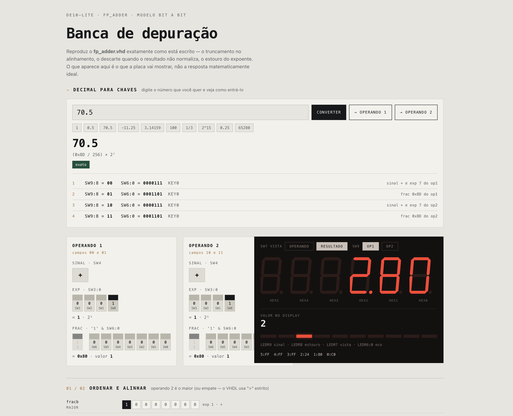

*Conversão de `70.5`: a página devolve `(0x8D / 256) × 2⁷`, classifica como **exato** e lista
os quatro passos de chaves. Abaixo, os painéis dos operandos bit a bit, a réplica dos displays
com o valor decimal, e o detalhamento estágio por estágio.*

**`de10_wave_player.html` — reprodutor de VCD.** Lê um VCD exportado do Questa
(o do nosso testbench está em [`debug/sim_demo.vcd`](debug/sim_demo.vcd)) e desenha a
DE10-Lite animada, com chaves, LEDs e os seis displays, mais uma linha do tempo por onde se
avança e retrocede na simulação. Um painel lateral mostra o valor decimal do que está no
display. Permitiu revisar a operação da placa sem precisar decorar padrões de sete segmentos.

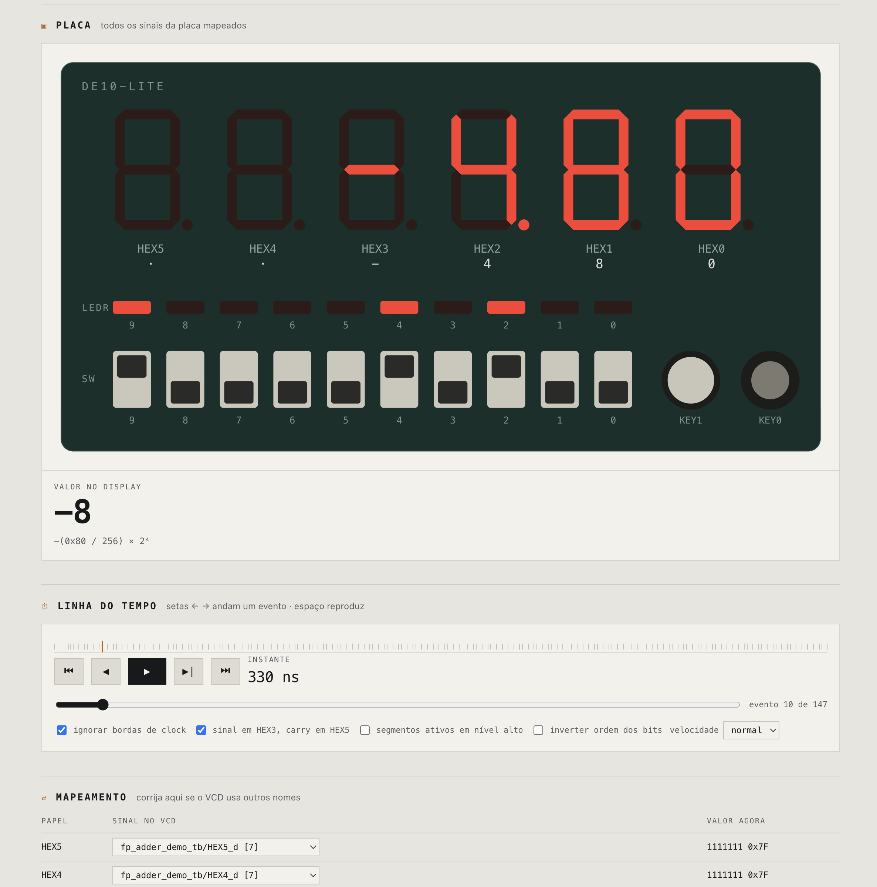

*Reprodução de `debug/sim_demo.vcd` no instante 330 ns (evento 10 de 147). Os displays mostram
`- 4. 8 0`, que o painel traduz para `−(0x80 / 256) × 2⁴ = −8`. Abaixo, a linha do tempo e a
tabela de mapeamento, que permite apontar outros nomes de sinal caso o VCD venha de um
testbench diferente.*

O uso do reprodutor está demonstrado em
[`img/de10-wave-player-uso.mp4`](img/de10-wave-player-uso.mp4): carregamento do VCD, navegação
pela linha do tempo e leitura dos displays acompanhando a simulação.

### 5.1 Prompts utilizados (seleção)

Abaixo, transcritos literalmente, os prompts que mudaram o rumo do projeto. Cada um está
seguido do que produziu.

> **[ChatGPT #1]** "Formate corretamente estes arquivos VHDL" *(seguido do texto colado
> diretamente do PDF do livro)*

> **[ChatGPT #2]** "Como criar o projeto no Quartus para a DE10-Lite e mapear os pinos dos
> displays, switches e botões?"

> **[Claude]** "Temos estes: 1) VHDL para um Floating Point Adder; 2) VHDL para uma
> demonstração deste FP que funciona na Placa DE10-LITE; 3) VHDL para um HEX to Seven-Segment
> display da DE10-LITE; 4) Assignments da Placa DE10-Lite. Primeiro ponto que tenho dúvida:
> consigo simular de maneira visual a placa no Questa?"

> **[Claude]** "Agora eu gostaria de pensar em como podemos transformar todos expoentes,
> sinais e fracs em inputs."

> **[Claude]** "Inicialmente só estou pensando em como representar o Carry na saída. […]
> Só de ideias, não execute ainda."

> **[Claude]** "Mas eu não consigo mostrar o valor do carry em si?"

> **[Claude]** "Remova possibilidade de colocar números não normalizados (sempre vamos forçar
> o primeiro bit 1). SW7 vai virar uma chave para alterar entre RESULTADO ou OPERANDO atual
> sendo modificado por SW9:8. O display vai mostrar em HEX0:2 o RESULTADO OU OPERANDO frac e
> exp. HEX3 um sinal de negativo se o número for negativo. HEX5 vai mostrar 'C' se houver
> carry. DP do HEX2 sempre aceso para demonstrar a separação entre o EXP(HEX2) e FRAC(1 e 0)"

> **[Claude]** *(anexando a Table 1 do livro)* "Me dê os `do_test`s para executar a simulação
> com estes casos de borda."

> **[Claude]** "Você deveria ter mantido o expoente e representado a fração mais próxima."

> **[Claude]** *(anexando print do waveform do Questa)* "Estas são as etapas do somador no
> simulador Questa. O que ocorreu no estágio de normalização para desviar do valor sugerido
> pelo paper?"

> **[Claude]** "Eu estou pensando se a `leado` que está 6 não deveria ser 2?"

> **[Claude]** "Desfaça qualquer melhoria no somador que você fez que causou divergências no
> EG3."

### 5.2 Os erros da IA (alucinações e enganos)

**(1) ChatGPT inventou a estrutura interna do ZIP de código do livro.**
Perguntado onde encontrar `hex_to_sseg.vhd` e `disp_mux.vhd`, respondeu com um caminho
detalhado e confiante:

```
vhdl/
└── ch04/
    ├── listing_4_1_hex_to_sseg.vhd
    ├── listing_4_2_disp_mux.vhd
```

Nomes de arquivo, esquema de numeração e hierarquia de pastas — **nada disso existe** com essa
forma. É alucinação clássica: estrutura plausível, apresentada com certeza, sem nenhum acesso
à fonte. *Correção:* extraímos os módulos diretamente do texto do PDF.

**(2) ChatGPT gerou um `hex_to_sseg` com a codificação de segmentos errada.**
A primeira versão usava ordem de bits/polaridade incompatível com a DE10-Lite. Os displays
acendiam padrões sem sentido. *Correção:* consultamos o manual da placa, confirmamos
`sseg(6..0) = gfedcba` ativo-baixo e refizemos a tabela — que, verificada, coincide com a do
livro. A IA "corrigiu" o arquivo só depois de recebermos o comportamento errado no hardware.

**(3) ChatGPT propôs um mapeamento de chaves que inutilizava o somador.**
A sugestão foi `frac <= "111" & SW(4 downto 0)`, prendendo três bits em `'1'`.

Isso restringe a fração a `0xE0`–`0xFF` → valores entre 0,875 e 0,996. Consequência que
a IA não previu: **nenhuma potência de dois é representável.** Não dá para digitar 1,0, nem
2,0, nem 0,5. Entre `1,0 × 2ᵉ` e `1,75 × 2ᵉ` existe um buraco que engole três quartos de cada
oitava — e é justamente onde estão os números de teste convenientes.
*Correção:* travamos apenas o bit 7 (`'1' & SW(6 downto 0)`), o único cuja fixação tem
justificativa técnica (normalização), e liberamos os outros sete.

**(4) ChatGPT usou `KEY1` como "carregar operando 2".**
Funcional, mas gasta um botão numa função que o seletor de campo já cobre, e deixa o projeto
sem reinício. *Correção:* `KEY0` carrega o campo apontado por `SW(9:8)`, e `KEY1` virou
**reinício com autoteste** (ambos os operandos em `+1,0`, resultado esperado `2,0`) — muito
mais útil para diagnosticar a placa.

**(5) ChatGPT propôs espalhar operandos e resultado por seis displays.**
`HEX5:HEX4` = operando 1, `HEX3:HEX2` = operando 2, `HEX1:HEX0` = resultado. Com dois dígitos
por número, não há espaço para sinal nem para separar expoente de fração — a leitura fica
ambígua. *Correção:* adotamos um número por vez, com `SW(7)` alternando o display, e usamos os
dígitos livres para sinal, estouro e separador.

**(6) Claude sugeriu "corrigir" o zero negativo — e estava errado quanto à fidelidade.**
Ao listar casos de borda, propôs forçar `sign_out <= '0'` quando o resultado é zero, tratando
o zero negativo como defeito. **A Table 1 do livro mostra explicitamente `−0.00E0` no eg. 3,
com o sinal preservado.** *Correção:* mantivemos `sign_out <= signb` como está. A própria IA
retratou-se quando confrontada com a tabela, mas a proposta inicial estava incorreta.

**(7) Claude buscou análogos "estruturais" para os casos da Table 1, em vez de traduzir os
números.** Pedimos os casos de teste correspondentes à tabela do livro; a IA varreu o espaço
de entradas procurando pares que exercitassem os mesmos ramos do circuito, descartando os
valores originais. *Correção humana:* "Você deveria ter mantido o expoente e representado a
fração mais próxima." Traduzir `0.54 → 0x8A`, `0.87 → 0xDF` etc. preserva a
rastreabilidade com o livro, o que a busca estrutural destruía.

**(8) Divergência entre o registro da conversa e o estado real dos arquivos.**
Ao final da sessão, o Claude produziu um resumo do próprio trabalho afirmando que o testbench
tinha "19 casos" e "~600 linhas", e
menciona um `fp_radix.do` de ~100 linhas. A versão que recebemos tinha **485 linhas e 5
casos**, e `fp_radix.do` **não está no repositório**. Isso não é alucinação de código, mas é
um lembrete de que **sumários gerados por IA sobre o próprio trabalho não são fonte confiável
de verdade** — conferimos contra os arquivos. A cobertura foi depois completada por nós, com
os seis casos complementares descritos em §4.3.

**(9) Números de validação não reproduzíveis.** O mesmo resumo cita varreduras de "16.777.216
combinações, 0 divergências", executadas em modelos JavaScript e GHDL dentro do ambiente da
IA. **Não conseguimos reproduzir essas execuções**, e portanto elas **não** são apresentadas
como evidência neste relatório. A evidência que sustenta o trabalho é a simulação no Questa
(§4.4–4.5) e a operação na placa (§4.7), ambas executadas por nós.

### 5.3 As correções humanas

| # | Erro da IA | Correção humana | Impacto |
|---|---|---|---|
| 1 | Caminhos inventados no ZIP do livro | extração dos módulos do próprio PDF | desbloqueou a compilação |
| 2 | Codificação de segmentos incompatível | leitura do manual da DE10-Lite | displays passaram a exibir dígitos |
| 3 | `"111" & SW(4:0)` — 3 bits travados | `'1' & SW(6:0)` — só o bit 7 | tornou potências de dois representáveis |
| 4 | `KEY1` como segunda carga | `KEY1` como reinício/autoteste | diagnóstico rápido na placa |
| 5 | Seis displays fragmentados | um número por vez + `SW(7)` de display | leitura sem ambiguidade |
| 6 | "Corrigir" o zero negativo | manter `sign_out <= signb` | fidelidade ao livro |
| 7 | Análogos estruturais da Table 1 | traduzir mantendo o expoente | rastreabilidade com o livro |
| 8 | Sumário divergente dos arquivos | conferência arquivo a arquivo | documentação honesta |
| 9 | Validações não reproduzíveis | descartadas como evidência | rigor da entrega |

Além disso, decisões estruturais foram **nossas, não da IA**, com a IA atuando como
levantadora de alternativas:

* **Escolha do protocolo de entrada.** A IA apresentou quatro opções (seletor nas chaves;
  contador nos botões; expoente reduzido a 3 bits; entrada via JTAG) com custos e perdas. A
  escolha pela opção do seletor foi nossa, e a justificativa decisiva — evitar debounce,
  porque a carga é idempotente enquanto um contador não seria — só ficou clara na discussão.
* **Exibir o carry como valor, não como alarme.** Partiu da nossa pergunta "mas eu não consigo
  mostrar o *valor* do carry em si?". A resposta — que o expoente verdadeiro é sempre
  exatamente 16, e por isso o `HEX2` sempre mostra `0` com o `C` aceso — veio da IA, mas a
  pergunta que a produziu foi humana.
* **Manter `fp_adder.vhd` intocado.** Decisão nossa, verificada por comparação de hash ao
  longo da sessão. A IA chegou a *propor* um underflow gradual (`sh := minimum(leado, expb)`)
  como melhoria; recusamos, porque afasta o comportamento do que o livro descreve.
* **Dúvida sobre `leado = 6`.** Ao ler o waveform, suspeitamos que o valor deveria ser 2, por
  causa dos dois zeros hexadecimais em `9'h003`. A IA demonstrou que 6 está certo —
  `sum` tem 9 bits, e dois zeros hexadecimais já valem cinco bits de zero, mais os dois de
  dentro do `0011`. Confirmado pelo teste decisivo: deslocar 6 dá `0xC0` (bit 7 aceso, ou
  seja, normalizado); deslocar 2 daria `0x0C`. Aqui a IA nos corrigiu, e a verificação
  independente foi nossa.

### 5.4 O que aceitamos, e por quê

Nem tudo o que a IA propôs foi rejeitado — a maior parte do que está no `fp_adder_demo.vhd`
nasceu de uma sugestão que analisamos e adotamos. Registramos aqui **o critério** usado em
cada caso, porque aceitar sem entender teria produzido o mesmo código sem nenhum aprendizado.

| Sugestão adotada | Por que aceitamos | O que aprendemos com isso |
|---|---|---|
| **Multiplexar a entrada por campo** (`SW(9:8)` seleciona, `KEY0` carrega) | Testamos o argumento contra a alternativa do contador nos botões e ele se sustentou: a carga por chaves é *idempotente*, então repetições causadas pelo quique do botão são inofensivas. Um contador não tem essa propriedade | Que uma escolha de interface pode **eliminar** um problema de hardware (debounce) em vez de tratá-lo. Passamos a olhar a idempotência como propriedade de projeto, não como detalhe |
| **Forçar o bit 7 da fração em `'1'`** | Verificamos a premissa no `fp_adder.vhd`: o primeiro estágio compara `exp & frac` como inteiro de 12 bits, e essa comparação só vale com operandos normalizados. Garantir isso na entrada custa um fio | Entendemos por que o livro exige entrada normalizada — não é convenção, é pré-condição do comparador. E que **garantir uma pré-condição na origem** costuma ser mais barato que detectar sua violação depois |
| **Ler o resultado pelos sete segmentos no testbench** | A alternativa óbvia — comparar `exp_out`/`frac_out` — deixaria o decodificador e a montagem dos displays sem verificação, justamente onde já tínhamos errado antes (§5.2, item 2) | Que o testbench deve exercitar a mesma interface que o usuário, e não um atalho interno. Um erro na tabela de segmentos passaria despercebido no outro formato |
| **Exibir o estouro como `C`, deduzido fora do somador** | Conferimos o raciocínio: com sinais iguais `exp_out` só pode ser `expb` ou `expb+1`, e o ramo geral (`expb − leado`, com `leado ≤ 7`) nunca produz `0` a partir de `expb = 15`. A dedução é válida sem tocar na entidade do livro | Que dá para **recuperar informação perdida** observando o entorno, sem modificar o bloco sob análise. Foi o achado conceitual mais útil do projeto |
| **`vsim -voptargs=+acc` no script** | Reproduzimos o problema: sem a flag, os `add wave` dos sinais internos falham em silêncio | Que otimização de simulação pode remover justamente o que se quer observar — e que ferramenta em silêncio não significa ferramenta correta |

Um contraste que vale registrar: **aceitamos a explicação sobre `leado = 6` e rejeitamos a
proposta de underflow gradual**, ambas vindas da mesma ferramenta na mesma conversa. A
primeira era verificável — bastava deslocar `0x03` seis casas e ver o bit 7 acender. A segunda
era uma melhoria numérica real, mas afastava o circuito do que o livro descreve, e o trabalho
pede fidelidade ao projeto original. **O critério não foi a confiança na ferramenta, e sim a
possibilidade de verificar e o alinhamento com o objetivo.**

### 5.5 Avaliação crítica do uso da ferramenta

**Onde ajudou muito:**

* **Volume mecânico.** Transcrever e formatar VHDL de um PDF, montar a tabela reversa de sete
  segmentos do testbench, escrever os `add wave` do script `.do` — trabalho tedioso e
  propenso a erro de digitação, feito em minutos.
* **Levantamento de alternativas.** Diante do gargalo de 26 bits em 10 chaves, ter quatro
  opções com custos explícitos acelerou muito a decisão. A armadilha do debounce no contador
  provavelmente só apareceria depois de gravada a placa.
* **Explicação sob demanda.** Perguntas como "por que o resultado desviou do livro?" e "por
  que a normalização precisa da entrada normalizada?" renderam explicações que mudaram nossa
  compreensão do circuito — em particular, entender que o quarto estágio normaliza a *saída* e
  confia na entrada.
* **Ferramentas descartáveis.** As duas páginas HTML de depuração não caberiam no orçamento de
  tempo do trabalho se fossem escritas à mão, e economizaram muitas rodadas de simulação.

**Onde exigiu vigilância constante:**

* **Confiança uniforme.** A IA descreve com o mesmo tom seguro tanto o que verificou quanto o
  que inventou. O caminho falso do ZIP (§5.2.1) veio na mesma voz das explicações corretas.
* **Conhecimento de hardware específico.** Codificação de segmentos, polaridade de botões e
  pinagem da DE10-Lite foram justamente os pontos de mais erro. **O manual da placa é a
  autoridade, não a IA.**
* **Consequências numéricas de decisões estruturais.** Nenhuma das duas ferramentas percebeu
  espontaneamente que travar três bits da fração eliminaria todas as potências de dois. O erro
  só apareceu quando tentamos digitar `1,0` e descobrimos que não dava.
* **Relatos sobre o próprio trabalho.** Contagens de casos, tamanhos de arquivo e resultados de
  varreduras precisaram ser conferidos contra os arquivos reais — e divergiram (§5.2.8, §5.2.9).

**O que mudou na nossa forma de trabalhar.** Três hábitos saíram deste projeto:

1. **Perguntar "como eu verifico isso?" antes de aceitar.** Foi o que separou a explicação do
   `leado` (verificável em dois deslocamentos) das varreduras de milhões de vetores
   (irreproduzíveis). O custo de verificar foi quase sempre menor que o custo de descobrir o
   erro depois — o `"111" & SW(4:0)` sobreviveu várias respostas até esbarrarmos nele na
   prática.
2. **Tratar a IA como interlocutora, não como fonte.** As melhores contribuições vieram de
   perguntas nossas — "e o valor do carry?", "o `leado` não deveria ser 2?" — e não de
   pedidos genéricos de código. Quem faz a pergunta precisa entender o problema; a IA acelera
   a resposta, não a formulação.
3. **Separar o que é fiel do que é melhor.** O underflow gradual era objetivamente mais
   preciso e mesmo assim foi recusado. Ter esse critério explícito evitou uma sequência de
   "melhorias" que teriam descaracterizado o projeto do livro.

**Conclusão.** A IA foi um acelerador real de produtividade e um bom tradutor técnico,
especialmente para explorar alternativas e explicar comportamento. Não foi confiável como
fonte de fatos sobre hardware específico, nem como relatora do próprio trabalho. O padrão que
funcionou foi: **usar a IA para gerar e explicar, e o manual da placa, o livro e a simulação
para decidir.** A responsabilidade técnica pelo que está neste repositório é inteiramente
nossa.

---

## 6. Contribuição dos participantes

Taxonomia **CRediT** (<https://credit.niso.org/>).

* **[Nome do Aluno 1]** — Administração do Projeto; Desenvolvimento, implementação e teste de
  software (VHDL do wrapper `fp_adder_demo`, protocolo de entrada por campo, layout dos
  displays); Análise Formal (dedução da detecção de estouro).
* **[Nome do Aluno 2]** — Validação de dados e experimentos (execução das simulações no
  Questa, conferência do 4º estágio nas formas de onda, testes na placa DE10-Lite);
  Investigação (síntese e gravação no Quartus).
* **[Nome do Aluno 3]** — Redação do manuscrito original (este documento); Curadoria de dados
  (registro e auditoria do uso de IA); Validação de dados e experimentos.

> **[placeholder]** — substituir os nomes e ajustar a divisão de papéis conforme a realidade
> do grupo.

---


## Apêndice — Estrutura do repositório

```
Trabalho-SD-2026.2/
├── CLAUDE.md                       instruções para assistentes de IA neste repositório
├── DOCUMENTATION.md                este documento
├── debug/
│   ├── fp_adder_debug.html         calculadora do formato + conversor decimal → chaves
│   ├── de10_wave_player.html       reprodutor de VCD com desenho animado da placa
│   ├── sim_demo.vcd                dump da simulacao, exportado do Questa
│   └── wavedrom/                   diagramas WaveDrom por caso (ondas.md + .json)
├── img/                            figuras, GIF e videos citados neste documento
├── tools/
│   └── vcd_to_wavedrom.py          converte o VCD nos diagramas de debug/wavedrom/
├── transcript_questa.txt           saida completa de `do sim_demo.do`
└── fp_adder/
    ├── fp_adder.qpf                projeto do Quartus
    ├── fp_adder.qsf                configuração (SEM pinagem — importar DE10_LITE.qsf)
    ├── DE10_LITE.qsf               pinagem oficial da Terasic
    ├── fp_adder.vhd                somador (Listing 3.19, intocado)
    ├── hex_to_sseg.vhd             decodificador de sete segmentos
    ├── fp_adder_demo.vhd           entidade topo — a adaptação
    ├── fp_adder_demo_tb.vhd        testbench auto-verificável
    └── sim_demo.do                 script de simulação do Questa
```
