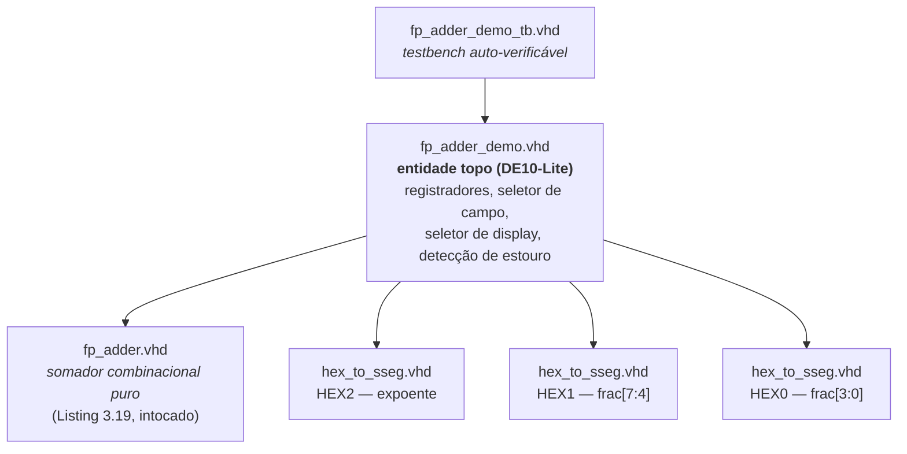
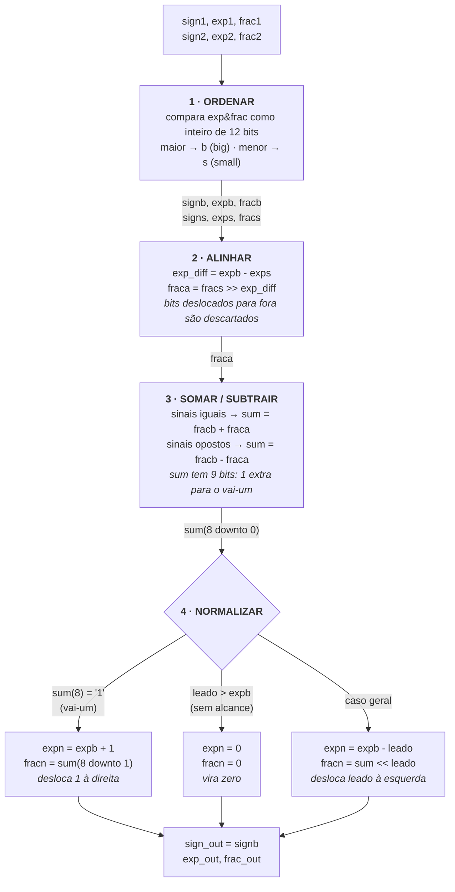
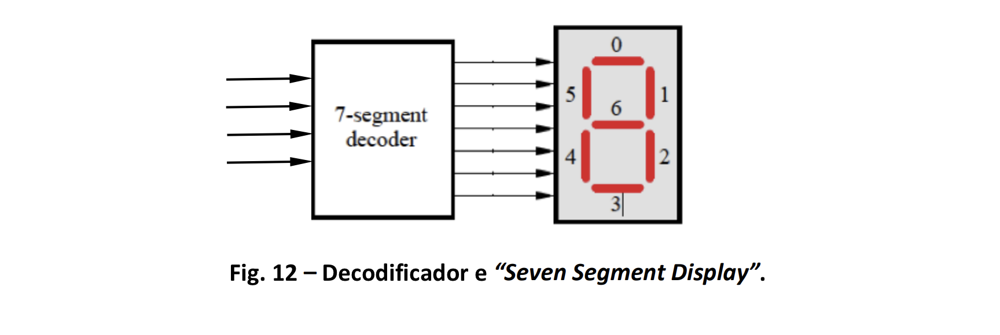
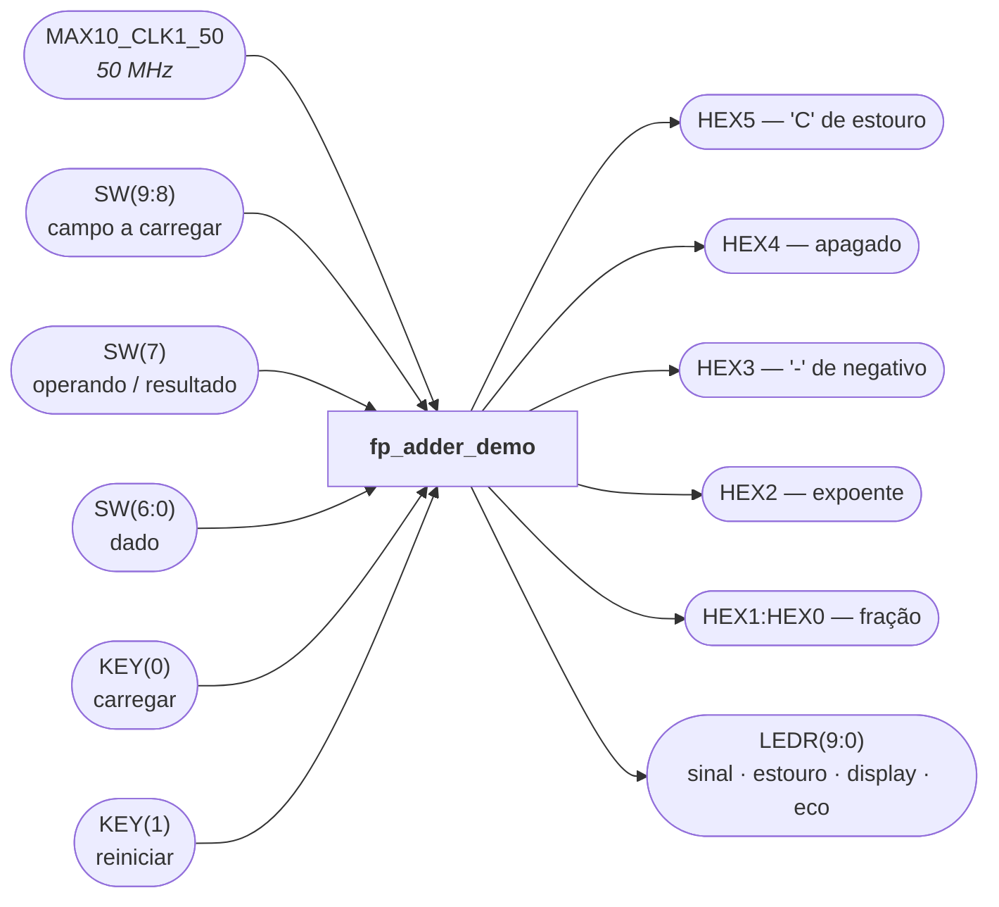
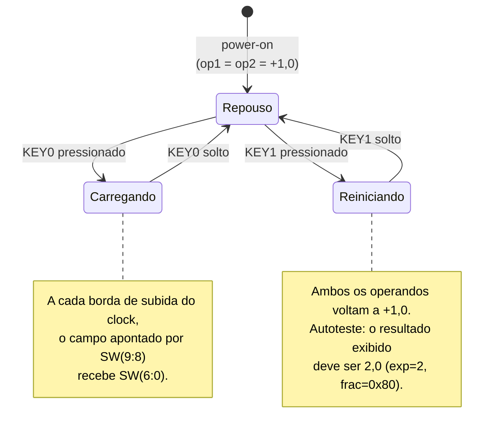
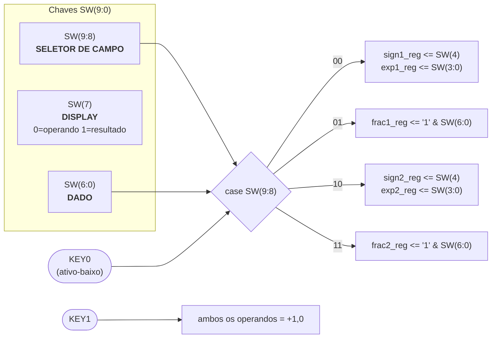
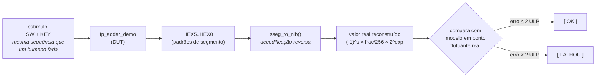

# Tutorial: Implementação de Somador de Ponto Flutuante na DE10-Lite

**Autores:** Kayky de Brito dos Santos, Igor Domingos da Silva Mozetic, Andre Luis Penha da Silva

**Disciplina:** MCTA024 — Sistemas Digitais — Q2.2026

**Data:** 10 de agosto de 2026

---

## Sumário

| Seção | Conteúdo | Etapa da disciplina |
|---|---|---|
| [1](#1-objetivo-do-projeto) | Objetivo do projeto | — |
| [2](#2-descrição-gráfica-do-funcionamento-do-sistema) | Descrição gráfica do funcionamento | Etapa 1 |
| [3](#3-adaptações-de-hardware-de10-lite) | Adaptações de hardware | Etapa 2 |
| [4](#4-evidências-de-validação) | Evidências de validação (simulação, código, placa) | Etapas 2 e 3 |
| [5](#5-diário-de-bordo-de-ia) | Diário de bordo de IA | Etapa 4 |
| [6](#6-contribuição-dos-participantes) | Contribuição dos participantes (CRediT) | Etapa 4 |

---

*Etapa 1*

## 1. Objetivo do Projeto

Este projeto adapta o somador de ponto flutuante simplificado de 13 bits da Listing 3.19 de
*FPGA Prototyping by VHDL Examples* (Pong P. Chu, §3.7.4) — escrito para a placa Digilent S3
com Spartan-3 — para a placa **Terasic DE10-Lite** (Intel MAX 10, `10M50DAF484C7G`).

O objetivo é validar o algoritmo original por simulação, adequá-lo aos recursos físicos da
placa que temos, sintetizá-lo no Quartus Prime e demonstrar seu funcionamento no hardware
real, documentando o processo — inclusive o uso de IA.

### Formato numérico

O somador opera sobre um formato de 13 bits:

$$
v = (-1)^{s} \times \frac{f}{256} \times 2^{e}
$$

| Campo | Largura | Domínio |
|---|---|---|
| $s$ — sinal | 1 bit | $s \in \{0, 1\}$, com $s = 1$ indicando número negativo |
| $e$ — expoente | 4 bits | $e \in [0, 15]$, inteiro **sem sinal**, sem excesso (*bias*) |
| $f$ — fração | 8 bits | $f \in [128, 255]$ — normalizada, bit 7 sempre `'1'` |

Equivalentemente, na notação do livro, $v = (-1)^{s} \times 0.f \times 2^{e}$, já que
$f / 256$ é exatamente a fração binária $0.f$ com 8 casas.

Diferenças relevantes em relação ao IEEE 754, que explicam várias decisões deste trabalho:

| | Nosso Somador | IEEE 754 |
|---|---|---|
| Bit mais significativo da fração | **armazenado** (gasta 1 bit para guardar uma constante) | implícito |
| Expoente | inteiro sem sinal, sem bias — só expoentes positivos | com excesso (bias) |
| Faixa | $[0{,}5;\ 32640]$ em magnitude | muito maior |
| Zero | não é representável de forma canônica (bit 7 forçado) | codificação reservada |
| Arredondamento | inexistente — truncamento puro | 5 modos |

Os extremos de magnitude não nula são, portanto:

$$
v_{\min} = \frac{128}{256} \times 2^{0} = 0{,}5
\qquad\qquad
v_{\max} = \frac{255}{256} \times 2^{15} = 32640
$$

---

## 2. Descrição gráfica do funcionamento do sistema

### 2.1 Hierarquia dos módulos



### 2.2 O algoritmo em quatro estágios (`fp_adder.vhd`)

O somador é **puramente combinacional**: não tem clock, nem reset, nem estado. Não existe
máquina de estados a documentar dentro dele — o diagrama abaixo é de fluxo de dados, não de
estados.



### 2.3 O quarto estágio em detalhe (ponto de observação da Etapa 1)

**(a) Contagem de zeros à esquerda — `leado`**, um codificador de prioridade que varre
`sum(7)` para baixo:

| Condição | `leado` | Significado |
|---|---|---|
| `sum(7) = '1'` | 0 | já normalizado |
| `sum(6) = '1'` | 1 | 1 zero à esquerda |
| `sum(5) = '1'` | 2 | 2 zeros |
| `sum(4) = '1'` | 3 | 3 zeros |
| `sum(3) = '1'` | 4 | 4 zeros |
| `sum(2) = '1'` | 5 | 5 zeros |
| `sum(1) = '1'` | 6 | 6 zeros |
| caso contrário | 7 | `sum(0)` ou tudo zero |

**(b) Deslocador barrel (`sum_norm`)**: desloca `sum(7 downto 0)` à esquerda por `leado`,
preenchendo com zeros.

**(c) Decisão final**, com os **quatro casos** cobertos pelos testes:

| Caso | Condição | Ação | Exemplo do livro |
|---|---|---|---|
| **I — sem ajuste** | `sum(8)=0`, `leado=0` | `expn = expb`, `fracn = sum` | eg. 1: `−0.82E4` |
| **II — desloca à esquerda** | `sum(8)=0`, `0 < leado ≤ expb` | `expn = expb − leado` | eg. 2: `−0.01E3 → −0.10E2` |
| **III — vira zero** | `sum(8)=0`, `leado > expb` | `expn = 0`, `fracn = 0` | eg. 3: `−0.01E0 → −0.00E0` |
| **IV — vai-um** | `sum(8)=1` | `expn = expb + 1`, desloca 1 à direita | eg. 4: `+1.07E3 → +0.10E4` |

### 2.4 Tabela verdade do decodificador (`hex_to_sseg.vhd`)

O decodificador de sete segmentos foi **reutilizado do Lab 3**, onde já havíamos implementado
e validado essa lógica em VHDL. A numeração dos segmentos é a mesma vista lá:



*Fig. 12 do roteiro do Lab 3 — decodificador e "Seven Segment Display".*

Os índices da figura correspondem diretamente aos bits do vetor de saída: o segmento `0` é o
traço superior (`a`), e a numeração segue no sentido horário até o `5` (`f`), com o `6` sendo
o traço central (`g`).

Displays da DE10-Lite são **ativos em nível baixo** (`'0'` acende o segmento). Ordem dos bits:
`sseg(6..0) = g f e d c b a`, e `sseg(7) = not dp`.

| `hex` | Dígito | `sseg(6:0)` | | `hex` | Dígito | `sseg(6:0)` |
|---|---|---|---|---|---|---|
| 0000 | 0 | `1000000` | | 1000 | 8 | `0000000` |
| 0001 | 1 | `1111001` | | 1001 | 9 | `0010000` |
| 0010 | 2 | `0100100` | | 1010 | A | `0001000` |
| 0011 | 3 | `0110000` | | 1011 | b | `0000011` |
| 0100 | 4 | `0011001` | | 1100 | C | `0100111` |
| 0101 | 5 | `0010010` | | 1101 | d | `0100001` |
| 0110 | 6 | `0000010` | | 1110 | E | `0000110` |
| 0111 | 7 | `1111000` | | 1111 | F | `0001110` |

Um padrão usado no projeto **não está nesta tabela**: `0111111`, que acende apenas o segmento
`g` e desenha um traço. É o que o `HEX3` exibe quando o número mostrado é negativo.

### 2.5 Entradas e saídas da entidade topo

Todas as portas de `fp_adder_demo` e o papel de cada uma:



Com `SW(7) = '0'`, o `SW(9:8)` escolhe o campo a ser editado e o operando correspondente
aparece nos displays. Com `SW(7) = '1'`, os displays mostram o resultado.

### 2.6 Fluxo de operação na placa

O único elemento sequencial do sistema são os seis registradores de operando. O
comportamento é o de um banco de registradores com escrita seletiva — não há máquina de
estados com transições condicionais, então o diagrama abaixo descreve o fluxo de uso:



O caminho combinacional — soma, seleção do que exibir e decodificação para os sete segmentos —
é contínuo: qualquer mudança nos registradores ou na chave de display aparece nos dígitos no
mesmo instante, sem esperar borda de clock.

---

*Etapa 2*

## 3. Adaptações de Hardware (DE10-Lite)

### 3.1 O problema central: 26 bits de entrada, 10 chaves

O somador tem **dois operandos de 13 bits = 26 bits de entrada**. A DE10-Lite oferece 10
chaves e apenas **2 botões** (`KEY[1:0]`) — menos que a placa do livro, que tinha 4. O próprio
livro reconhece a limitação e a resolve amarrando um operando a uma constante:

```vhdl
-- Listing 3.20, original do livro (placa S3, 8 chaves + 4 botões)
sign1 <= '0';
exp1  <= "1000";
frac1 <= '1' & sw(1) & sw(0) & "10101";   -- operando 1 quase todo constante
sign2 <= sw(7);
exp2  <= btn;                              -- expoente vindo dos botões
frac2 <= '1' & sw(6 downto 0);
```

Isso torna a demonstração pobre: o operando 1 tem apenas 2 bits ajustáveis.

### 3.2 O que a arquitetura original usava, e o que mudamos

| | Original (Listing 3.20, Spartan-3 / S3) | Nossa adaptação (DE10-Lite) |
|---|---|---|
| **Displays** | 4 dígitos **multiplexados no tempo**, com `an(3:0)` de seleção e um único barramento `sseg` compartilhado | 6 dígitos **estáticos e independentes** (`HEX0`..`HEX5`), cada um com seus 8 pinos próprios |
| **Módulo `disp_mux`** | obrigatório, junto com um divisor de clock para varrer os dígitos | **removido** — a DE10-Lite não multiplexa displays |
| **Uso do clock** | varredura dos displays | **apenas** para registrar os operandos |
| **Entrada do operando 1** | constante fixa (`exp1="1000"`, `frac1` com 2 bits de chave) | **totalmente ajustável** |
| **Entrada do operando 2** | `sign2`=1 chave, `exp2`=4 botões, `frac2`=7 chaves | **totalmente ajustável** |
| **Botões** | `btn(3:0)` alimentando o expoente diretamente | `KEY0` = carregar campo, `KEY1` = reiniciar |
| **Sinal negativo** | `led3` com padrão de barra central, num dígito multiplexado | `HEX3` dedicado, constante `SSEG_MENOS` |
| **Estouro de expoente** | não sinalizado — dava a volta em silêncio | **`C` no HEX5** + `LEDR(8)` |
| **Visualização dos operandos** | inexistente | `SW(7)` alterna operando/resultado |
| **Nível lógico dos displays** | ativo-baixo | ativo-baixo (igual — o `hex_to_sseg` foi reaproveitado sem mudança) |

**O que mudamos, item a item:**

* **Removemos** o módulo `disp_mux` e o divisor de clock associado. Na DE10-Lite cada um dos
  seis displays tem pinos dedicados, então a multiplexação temporal — necessária na S3 —
  seria hardware inútil consumindo lógica e introduzindo cintilação.
* **Removemos** as constantes amarradas ao operando 1. Nenhum campo do formato permanece fixo.
* **Roteamos** as saídas para `HEX0`..`HEX5`, `LEDR(9:0)`, `KEY(1:0)` e `SW(9:0)` conforme o
  manual da DE10-Lite, importando as atribuições de pino do arquivo oficial `DE10_LITE.qsf`.
* **Reorganizamos** a entrada num **protocolo de multiplexação por campo**: `SW(9:8)` escolhe
  qual dos quatro campos receberá `SW(6:0)` quando `KEY0` for pressionado. Quatro cargas
  sucessivas descrevem os 26 bits usando 7 chaves de dado.
* **Reorganizamos** os displays num layout de leitura única (sinal · expoente · fração), em vez
  de espalhar operandos e resultado por dígitos separados.
* **Acrescentamos** o indicador `C` de estouro do expoente, deduzido **fora** do somador.
* **Acrescentamos** o seletor de display `SW(7)`, que permite conferir cada operando antes de
  ler o resultado — indispensável quando a entrada é feita em quatro etapas.

### 3.3 O somador em si não foi tocado

`fp_adder.vhd` está **byte a byte idêntico** à Listing 3.19, com uma única mudança
cosmética: indentação e comentários de seção. Nenhuma expressão, nenhum sinal, nenhuma
condição foi alterada. Todas as adaptações vivem no wrapper `fp_adder_demo.vhd`.

Essa restrição foi deliberada: o enunciado pede validar o projeto teórico e adaptá-lo ao
hardware, não reprojetá-lo. As limitações que encontramos (§3.7) estão documentadas como
achados, não corrigidas silenciosamente.

### 3.4 Protocolo de entrada por campo



| `SW(9:8)` | Campo carregado por `KEY0` | Bits de dado usados |
|---|---|---|
| `00` | sinal e expoente do **operando 1** | `SW(4)` = sinal, `SW(3:0)` = expoente |
| `01` | fração do **operando 1** | `frac = '1' & SW(6:0)` |
| `10` | sinal e expoente do **operando 2** | `SW(4)` = sinal, `SW(3:0)` = expoente |
| `11` | fração do **operando 2** | `frac = '1' & SW(6:0)` |

| Botão | Função | Observação |
|---|---|---|
| `KEY0` | carrega o campo apontado por `SW(9:8)` | ativo-baixo; **carga idempotente** |
| `KEY1` | reinicia ambos os operandos em `+1,0` | autoteste: o resultado deve ser `2,0` |

### 3.5 Normalização da entrada

```vhdl
frac_in <= '1' & SW(6 downto 0);
```

O bit 7 da fração não é ajustável. Consequência: **é impossível digitar um operando
desnormalizado.** Isso importa porque o primeiro estágio compara `exp & frac` como um inteiro
de 12 bits, e essa comparação só é válida se ambos os operandos estiverem normalizados. Com
entrada desnormalizada, o somador elege o operando errado como "maior" e produz lixo — sem
qualquer sinalização.

Garantir a precondição custou **um fio ligado em `'1'`**. Corrigir o sintoma dentro do somador
exigiria alinhar antes de comparar, mas só se sabe quanto alinhar depois de saber quem é o
maior — um problema circular.

### 3.6 Layout dos displays

```
   HEX5     HEX4     HEX3     HEX2     HEX1     HEX0
  ┌────┐   ┌────┐   ┌────┐   ┌────┐   ┌────┐   ┌────┐
  │ C  │   │    │   │ -  │   │ E. │   │ F  │   │ F  │
  └────┘   └────┘   └────┘   └────┘   └────┘   └────┘
   carry   apagado   sinal   expoente    fração (8 bits)
                                └── ponto SEMPRE aceso:
                                    marca a fronteira exp/frac
```

O `C` do `HEX5` é a letra inicial de **carry**: o vai-um do expoente, isto é, o bit que
sobrou quando `expb + 1` não coube nos 4 bits do campo.

| Display | Conteúdo | Fonte |
|---|---|---|
| `HEX5` | `C` de **carry** — o expoente estourou; apagado caso contrário | constante `SSEG_C` |
| `HEX4` | sempre apagado — separador visual | constante `SSEG_APAGADO` |
| `HEX3` | `-` quando o valor exibido é negativo | constante `SSEG_MENOS` |
| `HEX2` | expoente (0–F), com ponto decimal **sempre aceso** | `hex_to_sseg` |
| `HEX1` | fração, nibble alto | `hex_to_sseg` |
| `HEX0` | fração, nibble baixo | `hex_to_sseg` |

Exemplos de leitura:

```
   C _ -  2.  F  F     →   −(0xFF / 256) × 2^(2+16)  =  −65280
   _ _ _  5.  8  0     →    (0x80 / 256) × 2^5       =   16
```

| LED | Significado |
|---|---|
| `LEDR(9)` | sinal do resultado |
| `LEDR(8)` | carry do expoente (visível mesmo exibindo um operando) |
| `LEDR(7)` | display atual (aceso = resultado) |
| `LEDR(6:0)` | eco de `SW(6:0)` — confere o dado antes de carregar |

### 3.7 Detecção de estouro sem alterar o somador

O expoente tem 4 bits. Quando `expb = 15` e o vai-um dispara, `expn <= expb + 1` dá a volta
para `0`. Na conversa com a IA isso apareceu como `32640 + 32640` devolvendo `0,9961`.

A solução foi **deduzir o estouro de fora**, observando apenas os sinais já disponíveis, sem
alterar o `fp_adder`:

```vhdl
ovf <= '1' when sign1_reg = sign2_reg
                and (exp1_reg = "1111" or exp2_reg = "1111")
                and exp_out = "0000"
       else '0';
```

**Raciocínio:** com sinais iguais não há subtração, então `exp_out` só pode valer `expb` ou
`expb + 1`. Se `expb = 15`, o incremento dá a volta e sai `0`. Esse valor é impossível por
qualquer outro caminho quando `expb = 15`, porque o ramo geral calcula `expb − leado`, e com
`leado ≤ 7` isso nunca desce abaixo de 8. Como a ordenação coloca o maior expoente em `expb`,
testar `exp1 = 15 or exp2 = 15` equivale a testar `expb = 15`.

Quando `ovf` está ativo, o `C` aparece no `HEX5` e o expoente real é 16.

### 3.8 Pinagem

A pinagem é importada do arquivo oficial da Terasic via *Assignments → Import Assignments → `fp_adder/DE10_LITE.qsf`*.

| Sinal | Pinos (extrato) |
|---|---|
| `MAX10_CLK1_50` | `PIN_P11` |
| `KEY[0]`, `KEY[1]` | `PIN_B8`, `PIN_A7` |
| `SW[0]`..`SW[9]` | `PIN_C10`, `C11`, `D12`, `C12`, `A12`, `B12`, `A13`, `A14`, `B14`, `F15` |
| `LEDR[0]`..`LEDR[9]` | `PIN_A8`, `A9`, `A10`, `B10`, `D13`, `C13`, `E14`, `D14`, `A11`, `B11` |
| `HEX0[0..7]` | `PIN_C14`, `E15`, `C15`, `C16`, `E16`, `D17`, `C17`, `D15` |
| `HEX1`..`HEX5` | idem, conforme `DE10_LITE.qsf` |

Configuração do projeto: família **MAX 10**, dispositivo **`10M50DAF484C7G`**, entidade topo
**`fp_adder_demo`**, Quartus Prime **25.1std Lite**.

---

## 4. Evidências de Validação

### 4.1 Como reproduzir a simulação

Todo o fluxo de simulação é executado numa máquina Windows com Quartus Prime 25.1std Lite +
Questa. De dentro da pasta `fp_adder/`, no prompt do Questa:

```tcl
do sim_demo.do
```

O script:

1. recria a biblioteca `work`;
2. compila **nesta ordem obrigatória** (`vcom -2008`):
   `fp_adder.vhd` → `hex_to_sseg.vhd` → `fp_adder_demo.vhd` → `fp_adder_demo_tb.vhd`;
3. elabora com `vsim -voptargs=+acc` — **sem o `+acc`** o otimizador do Questa descarta
   `expb`, `exps`, `fraca`, `sum`, `leado` e `sum_norm`, e os `add wave` dos sinais internos
   falham **em silêncio**, sem mensagem de erro;
4. define um **radix customizado `sseg`**, que mostra na waveform o *dígito que aparece no
   display* em vez do padrão de bits dos segmentos;
5. roda até o fim e dá zoom na janela.

Warning benigno esperado em `t = 0`: `NUMERIC_STD.">": metavalue detected` — `leado` vale
`UUU` no primeiro delta, antes de qualquer estímulo.

### 4.2 Estratégia do testbench

`fp_adder_demo_tb.vhd` é **auto-verificável** e tem uma característica incomum: ele **não lê
os sinais internos do resultado**. Em vez disso, lê os seis displays de sete segmentos e os
decodifica de volta para nibbles (função `sseg_to_nib`), reconstruindo o número exibido.



Isso valida **o caminho completo**, incluindo o decodificador e a montagem dos displays — um
erro na tabela de segmentos seria pego. O testbench também confere o display de cada operando
(`SW(7) = '0'`) antes de olhar o resultado, garantindo que o protocolo de carga funcionou.

Sinais do tipo `real` (`val_op1`, `val_op2`, `val_esperado`, `val_placa`, `val_erro`) existem
exclusivamente para leitura decimal direta na janela Wave — não participam da verificação.

**Critério de aprovação:** tolerância de 2 ULP, isto é `2 × 2^exp / 256`. Truncamento ocorre
em dois pontos (alinhamento e deslocamento do vai-um), ambos sempre na mesma direção. Para
resultados abaixo do mínimo normalizável (`|valor| < 0,5`), o critério passa a ser
`frac = 0` exato.

### 4.3 Casos de teste

Os quatro casos vêm diretamente da Table 1 do livro (§3.7.4), traduzidos para binário
**mantendo o expoente e escolhendo a fração normalizada mais próxima**:

| Decimal | Fração binária | Valor exato | Erro |
|---|---|---|---|
| 0.54 | `0x8A` = 138 | 0,5390625 | 9,38 × 10⁻⁴ |
| 0.87 | `0xDF` = 223 | 0,87109375 | 1,09 × 10⁻³ |
| 0.55 | `0x8D` = 141 | 0,55078125 | 7,81 × 10⁻⁴ |
| 0.56 | `0x8F` = 143 | 0,55859375 | 1,41 × 10⁻³ |
| 0.52 | `0x85` = 133 | 0,51953125 | 4,69 × 10⁻⁴ |

| Teste | Entrada | Caso de normalização exercitado | Comportamento esperado |
|---|---|---|---|
| **EG1** | `+0.54E3 + (−0.87E4)` | **I** — sem ajuste | subtrai após alinhar 1 casa, permanece em E4 |
| **EG2** | `+0.54E3 + (−0.55E3)` | **III** — vira zero | cancelamento quase total; precisa de 6 bits de deslocamento e só há 3 de expoente |
| **EG3** | `+0.54E0 + (−0.55E0)` | **III** — vira zero | expoente no mínimo; equivale ao `−0.00E0` do livro |
| **EG4** | `+0.56E3 + (+0.52E3)` | **IV** — vai-um | soma estoura 8 bits, expoente sobe para E4 |
| **T10** | `KEY1` (reinício) | — | autoteste: `+1,0 + 1,0 = 2,0` exato |

> **Sobre o EG2 não reproduzir literalmente o livro.** Em decimal, `0.54 − 0.55 = −0.01`
> exige **um** dígito de deslocamento — fator 10, e `E3` cobre. Em binário,
> `0x8A − 0x8D = −3` exige **seis** bits — fator 64, e `E3` não alcança. Um dígito decimal
> vale ~3,3 bits. **Não é infidelidade ao livro: é a mesma regra, cobrada numa moeda de
> expoente mais cara.** Com `E6` o mesmo par renormaliza corretamente para `−0,75` exato.

O **caso II** (deslocamento à esquerda bem-sucedido) é exercitado pelo mesmo par de frações
com expoente suficiente. Recomendamos acrescentar um `do_test("EG2b", '0', 6, 16#8A#, '1', 6,
16#8D#)` ao testbench para deixar os quatro casos explicitamente cobertos por testes nomeados.

### 4.4 Formas de onda — o 4º estágio (normalização)

> **[placeholder — imagens a fornecer]**
> Rodar `do sim_demo.do` no Questa e capturar a janela Wave para cada caso.
> Os sinais que importam estão no divisor **"Estagios internos do somador"**:
> `expb`, `exps`, `exp_diff`, `fracb`, `fracs`, `fraca`, `sum`, `leado`, `sum_norm`,
> mais `exp_out` e `frac_out` no divisor "Resultado".

**Caso I — sem ajuste (EG1):** `sum(8)=0`, `leado=0`, resultado sai como está.


`[placeholder]` — esperado na captura: `expb=4`, `exps=3`, `exp_diff=1`, `fracb=0xDF`,
`fraca=0x45`, `sum=0x09A`, `leado=0`, `sum_norm=0x9A`, `exp_out=4`, `frac_out=0x9A`,
`sign_out='1'`.

**Caso II — deslocamento à esquerda (EG2b, `E6`):** `leado > 0` e `leado ≤ expb`.


`[placeholder]` — esperado: `sum=0x003`, `leado=6`, `sum_norm=0xC0`, `exp_out=0`,
`frac_out=0xC0` → `−0,75` exato. **Este é o caso que responde ao ponto de observação da
Etapa 1: o circuito conta os zeros e desloca à esquerda corretamente.**

**Caso III — resultado pequeno demais (EG2 em `E3` e EG3 em `E0`):** `leado > expb`.


`[placeholder]` — esperado: `sum=0x003`, `leado=6`, `sum_norm=0xC0` **calculado corretamente
mas descartado**, `exp_out=0`, `frac_out=0x00`. Vale a pena capturar esta forma de onda com
atenção: ela mostra o deslocador acertando a resposta e o estágio de decisão jogando-a fora
por falta de saldo no expoente.

**Caso IV — vai-um (EG4):** `sum(8)='1'`.


`[placeholder]` — esperado: `fracb=0x8F`, `fraca=0x85`, `sum=0x114` (o bit 8 aceso),
`exp_out=4`, `frac_out=0x8A` → `8,625` exato.

**Visão geral da simulação completa:**


`[placeholder]`

### 4.5 Transcript da simulação

> **[placeholder — saída a fornecer]**
> Colar aqui a saída completa do transcript do Questa após `do sim_demo.do`.
> Procurar por `[ FALHOU ]` e conferir a linha final.

```
[placeholder — transcript do Questa]

#####################################################################
  fp_adder_demo -- vista comutada por SW(7)
  HEX5=C(estouro)  HEX4=apagado  HEX3=sinal  HEX2=exp.  HEX1:HEX0=frac
  fracao sempre normalizada: frac = '1' & SW(6 downto 0)
#####################################################################

=====================================================================
 EG1
---------------------------------------------------------------------
   op1 = +  exp=3  frac=0x8A   ->        4.312500
   op2 = -  exp=4  frac=0xDF   ->      -13.937500
   esperado (real)                      -9.625000
   HEX5..HEX0 :  _  _  -  4.  9  A
   lido do display : - exp=4 frac=0x9A  ->       -9.625000
   erro =      0.000000   tolerancia (2 ULP) =      0.125000
   [ OK ]

   ... (demais casos) ...

#####################################################################
  RESULTADO: todos os testes passaram.
#####################################################################
```

*(O bloco acima reproduz o formato do transcript; os valores devem ser substituídos pela
saída real da execução.)*

### 4.6 Relatório de compilação do Quartus

> **[placeholder — imagens/dados a fornecer]**
> Após *Processing → Start Compilation*, capturar o **Flow Summary**.


`[placeholder]` — registrar: elementos lógicos utilizados, registradores, pinos, e confirmar
`Total registers = 26` (6 registradores: 2 sinais + 2 × 4 bits de expoente + 2 × 8 bits de
fração).


`[placeholder]` — *Tools → Netlist Viewers → RTL Viewer*, útil para mostrar a instância do
`fp_adder` e os três `hex_to_sseg`.

---

### 4.7 Código VHDL Final

#### 4.7.1 `fp_adder.vhd` — o somador (Listing 3.19, **não modificado**)

Reproduzido aqui por completude; a única diferença em relação ao livro é formatação.

```vhdl
-- Based on the book: FPGA Prototyping by VHDL Examples: Xilinx Spartan-3 Version
-- Pong P. Chu, 2007

library ieee;
use ieee.std_logic_1164.all;
use ieee.numeric_std.all;

entity fp_adder is
    port (
        sign1, sign2 : in  std_logic;
        exp1, exp2   : in  std_logic_vector(3 downto 0);
        frac1, frac2 : in  std_logic_vector(7 downto 0);

        sign_out : out std_logic;
        exp_out  : out std_logic_vector(3 downto 0);
        frac_out : out std_logic_vector(7 downto 0)
    );
end fp_adder;

architecture arch of fp_adder is

    -- suffix b, s, a, n for
    -- big, small, aligned, normalized number

    signal signb, signs : std_logic;
    signal expb, exps, expn : unsigned(3 downto 0);
    signal fracb, fracs, fraca, fracn : unsigned(7 downto 0);
    signal sum_norm : unsigned(7 downto 0);
    signal exp_diff : unsigned(3 downto 0);
    signal sum : unsigned(8 downto 0); -- one extra for carry
    signal leado : unsigned(2 downto 0);

begin

    -------------------------------------------------------------------------
    -- 1st stage: sort to find the larger number
    -------------------------------------------------------------------------
    process(sign1, sign2, exp1, exp2, frac1, frac2)
    begin
        if (exp1 & frac1) > (exp2 & frac2) then
            signb <= sign1;
            signs <= sign2;
            expb  <= unsigned(exp1);
            exps  <= unsigned(exp2);
            fracb <= unsigned(frac1);
            fracs <= unsigned(frac2);
        else
            signb <= sign2;
            signs <= sign1;
            expb  <= unsigned(exp2);
            exps  <= unsigned(exp1);
            fracb <= unsigned(frac2);
            fracs <= unsigned(frac1);
        end if;
    end process;

    -------------------------------------------------------------------------
    -- 2nd stage: align smaller number
    -------------------------------------------------------------------------
    exp_diff <= expb - exps;

    with exp_diff select
        fraca <=
            fracs                  when "0000",
            "0"       & fracs(7 downto 1) when "0001",
            "00"      & fracs(7 downto 2) when "0010",
            "000"     & fracs(7 downto 3) when "0011",
            "0000"    & fracs(7 downto 4) when "0100",
            "00000"   & fracs(7 downto 5) when "0101",
            "000000"  & fracs(7 downto 6) when "0110",
            "0000000" & fracs(7)          when "0111",
            "00000000"                  when others;

    -------------------------------------------------------------------------
    -- 3rd stage: add / subtract
    -------------------------------------------------------------------------
    sum <=
        ('0' & fracb) + ('0' & fraca) when signb = signs else
        ('0' & fracb) - ('0' & fraca);

    -------------------------------------------------------------------------
    -- 4th stage: normalize
    -------------------------------------------------------------------------

    -- Count leading zeros
    leado <=
        "000" when (sum(7) = '1') else
        "001" when (sum(6) = '1') else
        "010" when (sum(5) = '1') else
        "011" when (sum(4) = '1') else
        "100" when (sum(3) = '1') else
        "101" when (sum(2) = '1') else
        "110" when (sum(1) = '1') else
        "111";

    -- Shift significand according to leading zeros
    with leado select
        sum_norm <=
            sum(7 downto 0)         when "000",
            sum(6 downto 0) & '0'   when "001",
            sum(5 downto 0) & "00"  when "010",
            sum(4 downto 0) & "000" when "011",
            sum(3 downto 0) & "0000" when "100",
            sum(2 downto 0) & "00000" when "101",
            sum(1 downto 0) & "000000" when "110",
            sum(0) & "0000000" when others;

    -- Normalize with special conditions
    process(sum, sum_norm, expb, leado)
    begin
        if sum(8) = '1' then
            expn  <= expb + 1;
            -- Carry out: shift fraction right
            fracn <= sum(8 downto 1);

        elsif leado > expb then
            -- Too small to normalize: set to zero
            expn  <= (others => '0');
            fracn <= (others => '0');

        else
            expn  <= expb - leado;
            fracn <= sum_norm;
        end if;
    end process;

    -------------------------------------------------------------------------
    -- Output
    -------------------------------------------------------------------------
    sign_out <= signb;
    exp_out  <= std_logic_vector(expn);
    frac_out <= std_logic_vector(fracn);

end arch;
```

#### 4.7.2 `hex_to_sseg.vhd` — decodificador de sete segmentos

Reaproveitado do Capítulo 4 do livro. A codificação de segmentos da DE10-Lite coincide com a
da S3 (ativo-baixo, ordem `gfedcba`), então **nenhuma mudança foi necessária** — mas isso só
ficou claro depois de conferir o manual da placa (ver §5.2).

```vhdl
library ieee;
use ieee.std_logic_1164.all;

entity hex_to_sseg is
    port(
        hex  : in  std_logic_vector(3 downto 0);
        dp   : in  std_logic;
        sseg : out std_logic_vector(7 downto 0)
    );
end hex_to_sseg;


architecture arch of hex_to_sseg is
begin

    with hex select
        sseg(6 downto 0) <=

        -- gfedcba
        "1000000" when "0000", -- 0
        "1111001" when "0001", -- 1
        "0100100" when "0010", -- 2
        "0110000" when "0011", -- 3
        "0011001" when "0100", -- 4
        "0010010" when "0101", -- 5
        "0000010" when "0110", -- 6
        "1111000" when "0111", -- 7
        "0000000" when "1000", -- 8
        "0010000" when "1001", -- 9
        "0001000" when "1010", -- A
        "0000011" when "1011", -- b
        "0100111" when "1100", -- C
        "0100001" when "1101", -- d
        "0000110" when "1110", -- E
        "0001110" when others; -- F


    -- ponto decimal
    sseg(7) <= not dp;

end arch;
```

#### 4.7.3 `fp_adder_demo.vhd` — **a adaptação** (entidade topo)

Este é o arquivo onde vive todo o trabalho de adaptação. Os trechos de maior relevância estão
destacados abaixo do código completo.

```vhdl
library ieee;
use ieee.std_logic_1164.all;
use ieee.numeric_std.all;


------------------------------------------------------------------------
-- fp_adder_demo  --  DE10-Lite
--
-- ENTRADA
--
--     SW(9 downto 8) = campo        SW(6 downto 0) = dado
--
--        "00"  ->  sinal e expoente do operando 1
--        "01"  ->  fracao do operando 1
--        "10"  ->  sinal e expoente do operando 2
--        "11"  ->  fracao do operando 2
--
--     Nos campos de sinal/expoente:  SW(4) = sinal,  SW(3 downto 0) = exp
--     Nos campos de fracao:          frac = '1' & SW(6 downto 0)
--
--     A fracao e SEMPRE normalizada: o bit 7 nao e ajustavel, e nao
--     existe mais como digitar um operando fora do formato.
--
--     KEY0 = carrega o campo selecionado
--     KEY1 = reinicia os dois operandos em +1,0  (autoteste: mostra 2,0)
--
--
-- VISTA
--
--     SW(7) = '0'  ->  mostra o OPERANDO apontado por SW(9)
--     SW(7) = '1'  ->  mostra o RESULTADO
--
--
-- DISPLAYS
--
--     HEX5   "C" quando o expoente do resultado estourou
--     HEX4   apagado (separador visual)
--     HEX3   "-" quando o numero mostrado e negativo
--     HEX2   expoente, com o ponto decimal SEMPRE aceso
--     HEX1   fracao, nibble alto
--     HEX0   fracao, nibble baixo
--
--     O ponto aceso em HEX2 marca a fronteira entre expoente e fracao:
--
--          C _ -  2.  F  F      ->  -(0xFF/256) * 2^(2+16)
--          _ _ _  5.  8  0      ->   (0x80/256) * 2^5
--
--
-- SOBRE O "C" DO HEX5
--
--     Ele NAO mostra sum(8), o vai-um da soma de 9 bits. Aquele bit
--     acende em quase toda soma de sinais iguais -- e situacao normal,
--     nao merece aviso.
--
--     O "C" aqui marca o estouro do EXPOENTE: o expoente verdadeiro
--     seria 16, que nao cabe nos 4 bits do campo e da a volta para 0.
--     Ou seja, com o "C" aceso, o expoente correto e o que aparece
--     em HEX2 MAIS 16. O display continua legivel em vez de virar
--     apenas um alarme.
------------------------------------------------------------------------

entity fp_adder_demo is
    port(
        MAX10_CLK1_50 : in std_logic;

        KEY : in std_logic_vector(1 downto 0);
        SW  : in std_logic_vector(9 downto 0);

        LEDR : out std_logic_vector(9 downto 0);

        HEX0 : out std_logic_vector(7 downto 0);
        HEX1 : out std_logic_vector(7 downto 0);
        HEX2 : out std_logic_vector(7 downto 0);
        HEX3 : out std_logic_vector(7 downto 0);
        HEX4 : out std_logic_vector(7 downto 0);
        HEX5 : out std_logic_vector(7 downto 0)
    );
end fp_adder_demo;


architecture arch of fp_adder_demo is


    --------------------------------------------------------------------
    -- padroes de segmento montados a mao
    --
    -- O hex_to_sseg so sabe gerar 0 a F. Traco e apagado nao estao na
    -- tabela dele, e isso e uma vantagem: nenhum resultado legitimo
    -- consegue imitar esses dois padroes.
    --
    --                                       dp gfedcba
    --------------------------------------------------------------------

    constant SSEG_APAGADO : std_logic_vector(7 downto 0) := "1" & "1111111";
    constant SSEG_MENOS   : std_logic_vector(7 downto 0) := "1" & "0111111";
    constant SSEG_C       : std_logic_vector(7 downto 0) := "1" & "0100111";


    -- valor de reinicio: +1,0  =  (0x80 / 256) * 2^1

    constant EXP_UM  : std_logic_vector(3 downto 0) := "0001";
    constant FRAC_UM : std_logic_vector(7 downto 0) := "10000000";


    -- operandos armazenados

    signal sign1_reg : std_logic                    := '0';
    signal exp1_reg  : std_logic_vector(3 downto 0) := EXP_UM;
    signal frac1_reg : std_logic_vector(7 downto 0) := FRAC_UM;

    signal sign2_reg : std_logic                    := '0';
    signal exp2_reg  : std_logic_vector(3 downto 0) := EXP_UM;
    signal frac2_reg : std_logic_vector(7 downto 0) := FRAC_UM;


    -- fracao vinda das chaves, sempre normalizada

    signal frac_in : std_logic_vector(7 downto 0);


    -- saida do adder

    signal sign_out : std_logic;
    signal exp_out  : std_logic_vector(3 downto 0);
    signal frac_out : std_logic_vector(7 downto 0);

    signal ovf : std_logic;


    -- operando apontado por SW(9)

    signal op_sign : std_logic;
    signal op_exp  : std_logic_vector(3 downto 0);
    signal op_frac : std_logic_vector(7 downto 0);


    -- o que vai para os displays

    signal ver_sign : std_logic;
    signal ver_exp  : std_logic_vector(3 downto 0);
    signal ver_frac : std_logic_vector(7 downto 0);


begin


    ------------------------------------------------------------------
    -- Fracao das chaves: bit escondido garantido em '1'
    ------------------------------------------------------------------

    frac_in <= '1' & SW(6 downto 0);


    ------------------------------------------------------------------
    -- Captura dos campos
    ------------------------------------------------------------------

    process(MAX10_CLK1_50)
    begin

        if rising_edge(MAX10_CLK1_50) then


            -- KEY0: carrega o campo apontado por SW(9 downto 8)

            if KEY(0) = '0' then

                case SW(9 downto 8) is

                    when "00" =>
                        sign1_reg <= SW(4);
                        exp1_reg  <= SW(3 downto 0);

                    when "01" =>
                        frac1_reg <= frac_in;

                    when "10" =>
                        sign2_reg <= SW(4);
                        exp2_reg  <= SW(3 downto 0);

                    when others =>
                        frac2_reg <= frac_in;

                end case;

            end if;


            -- KEY1: reinicia os dois operandos em +1,0

            if KEY(1) = '0' then

                sign1_reg <= '0';
                exp1_reg  <= EXP_UM;
                frac1_reg <= FRAC_UM;

                sign2_reg <= '0';
                exp2_reg  <= EXP_UM;
                frac2_reg <= FRAC_UM;

            end if;


        end if;

    end process;


    ------------------------------------------------------------------
    -- Somador FP
    ------------------------------------------------------------------

    fp_add : entity work.fp_adder

        port map(

            sign1 => sign1_reg,
            sign2 => sign2_reg,

            exp1 => exp1_reg,
            exp2 => exp2_reg,

            frac1 => frac1_reg,
            frac2 => frac2_reg,

            sign_out => sign_out,
            exp_out  => exp_out,
            frac_out => frac_out

        );


    ------------------------------------------------------------------
    -- Estouro do expoente, deduzido de fora do somador
    --
    -- Com sinais iguais nao ha subtracao, entao exp_out so pode valer
    -- expb ou expb+1. Se expb = 15, o incremento da a volta e exp_out
    -- sai 0 -- resultado impossivel por qualquer outro caminho quando
    -- expb = 15, porque o ramo de normalizacao faz expb - leado, que
    -- com leado no maximo 7 nunca desce abaixo de 8.
    --
    -- expb = 15 equivale a algum dos dois expoentes ser 15, ja que a
    -- chave de ordenacao coloca o maior expoente em expb.
    ------------------------------------------------------------------

    ovf <= '1' when sign1_reg = sign2_reg
                    and (exp1_reg = "1111" or exp2_reg = "1111")
                    and exp_out = "0000"
           else '0';


    ------------------------------------------------------------------
    -- Vista: SW(9) escolhe o operando, SW(7) escolhe operando/resultado
    ------------------------------------------------------------------

    op_sign <= sign1_reg when SW(9) = '0' else sign2_reg;
    op_exp  <= exp1_reg  when SW(9) = '0' else exp2_reg;
    op_frac <= frac1_reg when SW(9) = '0' else frac2_reg;

    ver_sign <= sign_out when SW(7) = '1' else op_sign;
    ver_exp  <= exp_out  when SW(7) = '1' else op_exp;
    ver_frac <= frac_out when SW(7) = '1' else op_frac;


    ------------------------------------------------------------------
    -- LEDs
    ------------------------------------------------------------------

    LEDR(6 downto 0) <= SW(6 downto 0);   -- eco do dado nas chaves

    LEDR(7) <= SW(7);                     -- vista: aceso = resultado

    LEDR(8) <= ovf;                       -- estouro (mesmo na vista do operando)

    LEDR(9) <= sign_out;                  -- sinal do resultado


    ------------------------------------------------------------------
    -- Displays montados a mao
    ------------------------------------------------------------------

    -- so acende na vista do resultado: operando nenhum tem carry
    HEX5 <= SSEG_C when (SW(7) = '1' and ovf = '1') else SSEG_APAGADO;

    HEX4 <= SSEG_APAGADO;

    HEX3 <= SSEG_MENOS when ver_sign = '1' else SSEG_APAGADO;


    ------------------------------------------------------------------
    -- Displays decodificados
    ------------------------------------------------------------------

    HEX2_UNIT : entity work.hex_to_sseg
        port map(
            hex  => ver_exp,
            dp   => '1',            -- sempre aceso: separa expoente de fracao
            sseg => HEX2
        );

    HEX1_UNIT : entity work.hex_to_sseg
        port map(
            hex  => ver_frac(7 downto 4),
            dp   => '0',
            sseg => HEX1
        );

    HEX0_UNIT : entity work.hex_to_sseg
        port map(
            hex  => ver_frac(3 downto 0),
            dp   => '0',
            sseg => HEX0
        );


end arch;
```

#### 4.7.4 Trechos-chave da adaptação

Os quatro pontos abaixo são **a substância da adaptação** — tudo o mais é fiação.

**(A) Bit escondido — normalização garantida por construção** *(§3.5)*

```vhdl
frac_in <= '1' & SW(6 downto 0);
```

Uma linha que torna impossível violar a precondição do primeiro estágio.

**(B) Multiplexação de entrada por campo** *(§3.4)*

```vhdl
if KEY(0) = '0' then
    case SW(9 downto 8) is
        when "00" =>  sign1_reg <= SW(4);  exp1_reg <= SW(3 downto 0);
        when "01" =>  frac1_reg <= frac_in;
        when "10" =>  sign2_reg <= SW(4);  exp2_reg <= SW(3 downto 0);
        when others => frac2_reg <= frac_in;
    end case;
end if;
```

Resolve o gargalo de 26 bits em 10 chaves sem debounce, porque a escrita é idempotente.

**(C) Detecção de estouro fora do somador** *(§3.7)*

```vhdl
ovf <= '1' when sign1_reg = sign2_reg
                and (exp1_reg = "1111" or exp2_reg = "1111")
                and exp_out = "0000"
       else '0';
```

Recupera informação que o somador perdeu, sem alterar uma linha sequer da Listing 3.19.

**(D) Padrões de display fora da tabela do decodificador** *(§2.4)*

```vhdl
constant SSEG_APAGADO : std_logic_vector(7 downto 0) := "1" & "1111111";
constant SSEG_MENOS   : std_logic_vector(7 downto 0) := "1" & "0111111";
constant SSEG_C       : std_logic_vector(7 downto 0) := "1" & "0100111";
```

Escolhidos por serem **inimitáveis** por qualquer valor válido — sinalização sem ambiguidade.

---

*Etapa 3*

### 4.8 Funcionamento na Placa

#### Procedimento de gravação

1. Abrir `fp_adder/fp_adder.qpf` no Quartus Prime 25.1std Lite.
2. *Assignments → Import Assignments…* → selecionar `fp_adder/DE10_LITE.qsf`.
   **Este passo é obrigatório** — o `.qsf` do projeto não contém pinagem.
3. Conferir *Assignments → Device*: família **MAX 10**, dispositivo **`10M50DAF484C7G`**.
4. *Processing → Start Compilation*.
5. *Tools → Programmer* → USB-Blaster → carregar `output_files/fp_adder.sof` → *Start*.

#### Sequência de operação (exemplo: `1,0 + 0,5 = 1,5`)

| Passo | `SW(9:8)` | `SW(6:0)` | Ação | Efeito |
|---|---|---|---|---|
| 1 | `00` | `0000001` | `KEY0` | op1: sinal `+`, expoente 1 |
| 2 | `01` | `0000000` | `KEY0` | op1: `frac = 0x80` → **1,0** |
| 3 | `10` | `0000000` | `KEY0` | op2: sinal `+`, expoente 0 |
| 4 | `11` | `0000000` | `KEY0` | op2: `frac = 0x80` → **0,5** |
| 5 | — | — | `SW(7) = 1` | mostra `_ _ _ 1. C 0` → **1,5** |

Lembrete: nos campos de sinal/expoente, `SW(4)` é o bit de sinal e `SW(3:0)` o expoente;
`SW(6:5)` são ignorados.

#### Casos demonstrados na placa

> **[placeholder — fotografias a fornecer]**
> Fotografar a placa com os displays legíveis, um registro por caso. Sugestão: enquadrar
> chaves + displays na mesma foto para que a entrada seja verificável na imagem.

**Caso 1 — Autoteste (`KEY1`): `+1,0 + 1,0 = 2,0`**
Displays esperados: `_ _ _ 2. 8 0`


`[placeholder]`

**Caso 2 — Normalização com deslocamento à esquerda (caso II)**
Sugestão: `+0.54E6 + (−0.55E6)`, isto é `exp=6 frac=0x8A` e `exp=6 frac=0x8D` negativo.
Displays esperados: `_ _ - 0. C 0` → `−0,75`


`[placeholder]`

**Caso 3 — Vai-um / carry out (caso IV, EG4)**
`+0.56E3 + (+0.52E3)`: `exp=3 frac=0x8F` e `exp=3 frac=0x85`.
Displays esperados: `_ _ _ 4. 8 A` → `8,625`


`[placeholder]`

**Caso 4 — Estouro do expoente, indicador `C`**
`32640 + 32640`: ambos com `exp=15 frac=0xFF`.
Displays esperados: `C _ _ 0. F F` → expoente real `0 + 16 = 16` → **65280**.
`LEDR(8)` deve estar aceso.


`[placeholder]`

**Caso 5 — Resultado pequeno demais vira zero (caso III, EG3)**
`+0.54E0 + (−0.55E0)`: `exp=0 frac=0x8A` e `exp=0 frac=0x8D` negativo.
Displays esperados: `_ _ - 0. 0 0` — zero com o sinal negativo preservado, exatamente o
`−0.00E0` da Table 1 do livro.


`[placeholder]`

#### Vídeo (opcional)

> **[placeholder]** — link para vídeo curto demonstrando a sequência de carga dos quatro
> campos e a leitura do resultado.

---

*Etapa 4*

## 5. Diário de Bordo de IA

Utilizamos **ChatGPT** (formatação inicial, primeira versão do wrapper de placa e depuração
no Quartus) e **Claude** (testbench auto-verificável, script de simulação, análise de casos de
borda e ferramentas de depuração). Os registros completos das conversas estão em
[`resources/`](resources/):

| Arquivo | Ferramenta | Assunto |
|---|---|---|
| [`resources/chat_gpt_01.txt`](resources/chat_gpt_01.txt) | ChatGPT | formatação do VHDL extraído do PDF; busca pelos módulos auxiliares |
| [`resources/chat_gpt_02.txt`](resources/chat_gpt_02.txt) | ChatGPT | criação do projeto no Quartus, pinagem, primeira versão do `fp_adder_demo` |
| [`resources/claude_03.md`](resources/claude_03.md) | Claude | testbench, `sim_demo.do`, protocolo de campo, indicador `C`, análise de casos de borda |

Artefatos de depuração gerados com IA e mantidos em [`debug/`](debug/):

| Arquivo | Função |
|---|---|
| [`debug/fp_adder_debug.html`](debug/fp_adder_debug.html) | calculadora bit a bit do formato + conversor decimal → sequência de chaves |
| [`debug/de10_wave_player.html`](debug/de10_wave_player.html) | reprodutor de VCD exportado do Questa, desenhando a placa animada com linha do tempo |

Ambos são **ferramentas de apoio**, não fazem parte do hardware entregue. O
`fp_adder_debug.html` foi particularmente útil para gerar valores esperados antes de rodar a
simulação; o `de10_wave_player.html` permitiu revisar a operação da placa a partir do VCD sem
precisar decorar padrões de sete segmentos.

### 5.1 Prompts utilizados (seleção)

Reproduzimos abaixo os prompts que mais influenciaram o resultado final. A lista completa
está nos arquivos de `resources/`.

> **[ChatGPT #1]** "Formate corretamente estes arquivos VHDL" *(seguido do texto colado
> diretamente do PDF do livro)*

> **[ChatGPT #2]** "Como criar o projeto no Quartus para a DE10-Lite e mapear os pinos dos
> displays, switches e botões?"

> **[Claude]** "Temos estes: 1) VHDL para um Floating Point Adder; 2) VHDL para uma
> demonstração deste FP que funciona na Placa DE10-LITE; 3) VHDL para um HEX to Seven-Segment
> display da DE10-LITE; 4) Assignments da Placa DE10-Lite. Primeiro ponto que tenho dúvida:
> consigo simular de maneira visual a placa no Questa?"

> **[Claude]** "Agora eu gostaria de pensar em como podemos transformar todos expoentes,
> sinais e fracs em inputs."

> **[Claude]** "Inicialmente só estou pensando em como representar o Carry na saída. […]
> Só de ideias, não execute ainda."

> **[Claude]** "Mas eu não consigo mostrar o valor do carry em si?"

> **[Claude]** "Remova possibilidade de colocar números não normalizados (sempre vamos forçar
> o primeiro bit 1). SW7 vai virar uma chave para alterar entre RESULTADO ou OPERANDO atual
> sendo modificado por SW9:8. O display vai mostrar em HEX0:2 o RESULTADO OU OPERANDO frac e
> exp. HEX3 um sinal de negativo se o número for negativo. HEX5 vai mostrar 'C' se houver
> carry. DP do HEX2 sempre aceso para demonstrar a separação entre o EXP(HEX2) e FRAC(1 e 0)"

> **[Claude]** *(anexando a Table 1 do livro)* "Me dê os `do_test`s para executar a simulação
> com estes casos de borda."

> **[Claude]** "Você deveria ter mantido o expoente e representado a fração mais próxima."

> **[Claude]** *(anexando print do waveform do Questa)* "Estas são as etapas do somador no
> simulador Questa. O que ocorreu no estágio de normalização para desviar do valor sugerido
> pelo paper?"

> **[Claude]** "Eu estou pensando se a `leado` que está 6 não deveria ser 2?"

> **[Claude]** "Desfaça qualquer melhoria no somador que você fez que causou divergências no
> EG3."

### 5.2 Os erros da IA (alucinações e enganos)

**(1) ChatGPT inventou a estrutura interna do ZIP de código do livro.**
Perguntado onde encontrar `hex_to_sseg.vhd` e `disp_mux.vhd`, respondeu com um caminho
detalhado e confiante:

```
vhdl/
└── ch04/
    ├── listing_4_1_hex_to_sseg.vhd
    ├── listing_4_2_disp_mux.vhd
```

Nomes de arquivo, esquema de numeração e hierarquia de pastas — **nada disso existe** com essa
forma. É alucinação clássica: estrutura plausível, apresentada com certeza, sem nenhum acesso
à fonte. *Correção:* extraímos os módulos diretamente do texto do PDF.

**(2) ChatGPT gerou um `hex_to_sseg` com a codificação de segmentos errada.**
A primeira versão usava ordem de bits/polaridade incompatível com a DE10-Lite. Os displays
acendiam padrões sem sentido. *Correção:* consultamos o manual da placa, confirmamos
`sseg(6..0) = gfedcba` ativo-baixo e refizemos a tabela — que, verificada, coincide com a do
livro. A IA "corrigiu" o arquivo só depois de recebermos o comportamento errado no hardware.

**(3) ChatGPT propôs um mapeamento de chaves que inutilizava o somador.**
A sugestão foi `frac <= "111" & SW(4 downto 0)`, prendendo três bits em `'1'`.

Isso restringe a fração a `0xE0`–`0xFF` → valores entre 0,875 e 0,996. Consequência que
a IA não previu: **nenhuma potência de dois é representável.** Não dá para digitar 1,0, nem
2,0, nem 0,5. Entre `1,0 × 2ᵉ` e `1,75 × 2ᵉ` existe um buraco que engole três quartos de cada
oitava — e é justamente onde estão os números de teste convenientes.
*Correção:* travamos apenas o bit 7 (`'1' & SW(6 downto 0)`), o único cuja fixação tem
justificativa técnica (normalização), e liberamos os outros sete.

**(4) ChatGPT usou `KEY1` como "carregar operando 2".**
Funcional, mas gasta um botão numa função que o seletor de campo já cobre, e deixa o projeto
sem reinício. *Correção:* `KEY0` carrega o campo apontado por `SW(9:8)`, e `KEY1` virou
**reinício com autoteste** (ambos os operandos em `+1,0`, resultado esperado `2,0`) — muito
mais útil para diagnosticar a placa.

**(5) ChatGPT propôs espalhar operandos e resultado por seis displays.**
`HEX5:HEX4` = operando 1, `HEX3:HEX2` = operando 2, `HEX1:HEX0` = resultado. Com dois dígitos
por número, não há espaço para sinal nem para separar expoente de fração — a leitura fica
ambígua. *Correção:* adotamos um número por vez, com `SW(7)` alternando o display, e usamos os
dígitos livres para sinal, estouro e separador.

**(6) Claude sugeriu "corrigir" o zero negativo — e estava errado quanto à fidelidade.**
Ao listar casos de borda, propôs forçar `sign_out <= '0'` quando o resultado é zero, tratando
o zero negativo como defeito. **A Table 1 do livro mostra explicitamente `−0.00E0` no eg. 3,
com o sinal preservado.** *Correção:* mantivemos `sign_out <= signb` como está. A própria IA
retratou-se quando confrontada com a tabela, mas a proposta inicial estava incorreta.

**(7) Claude buscou análogos "estruturais" para os casos da Table 1, em vez de traduzir os
números.** Pedimos os casos de teste correspondentes à tabela do livro; a IA varreu o espaço
de entradas procurando pares que exercitassem os mesmos ramos do circuito, descartando os
valores originais. *Correção humana:* "Você deveria ter mantido o expoente e representado a
fração mais próxima." Traduzir `0.54 → 0x8A`, `0.87 → 0xDF` etc. preserva a
rastreabilidade com o livro, o que a busca estrutural destruía.

**(8) Divergência entre o registro da conversa e o estado real dos arquivos.**
O log em `resources/claude_03.md` afirma que o testbench tem "19 casos" e "~600 linhas", e
menciona um `fp_radix.do` de ~100 linhas. O arquivo versionado tem **485 linhas e 5 casos**
(EG1–EG4 + T10), e `fp_radix.do` **não está no repositório**. Isso não é alucinação de código,
mas é um lembrete de que **sumários gerados por IA sobre o próprio trabalho não são fonte
confiável de verdade** — conferimos contra os arquivos. Também notamos que o `EG2b` citado no
log não sobreviveu ao arquivo final; ele é recomendado em §4.3 justamente por cobrir o caso II
de normalização de forma explícita.

**(9) Números de validação não reproduzíveis.** O log cita varreduras de "16.777.216
combinações, 0 divergências", executadas em modelos JavaScript e GHDL dentro do ambiente da
IA. **Não conseguimos reproduzir essas execuções**, e portanto elas **não** são apresentadas
como evidência neste relatório. A evidência que sustenta o trabalho é a simulação no Questa
(§4.4–4.5) e a operação na placa (§4.8), ambas executadas por nós.

### 5.3 As correções humanas

| # | Erro da IA | Correção humana | Impacto |
|---|---|---|---|
| 1 | Caminhos inventados no ZIP do livro | extração dos módulos do próprio PDF | desbloqueou a compilação |
| 2 | Codificação de segmentos incompatível | leitura do manual da DE10-Lite | displays passaram a exibir dígitos |
| 3 | `"111" & SW(4:0)` — 3 bits travados | `'1' & SW(6:0)` — só o bit 7 | tornou potências de dois representáveis |
| 4 | `KEY1` como segunda carga | `KEY1` como reinício/autoteste | diagnóstico rápido na placa |
| 5 | Seis displays fragmentados | um número por vez + `SW(7)` de display | leitura sem ambiguidade |
| 6 | "Corrigir" o zero negativo | manter `sign_out <= signb` | fidelidade ao livro |
| 7 | Análogos estruturais da Table 1 | traduzir mantendo o expoente | rastreabilidade com o livro |
| 8 | Sumário divergente dos arquivos | conferência arquivo a arquivo | documentação honesta |
| 9 | Validações não reproduzíveis | descartadas como evidência | rigor da entrega |

Além disso, decisões estruturais foram **nossas, não da IA**, com a IA atuando como
levantadora de alternativas:

* **Escolha do protocolo de entrada.** A IA apresentou quatro opções (seletor nas chaves;
  contador nos botões; expoente reduzido a 3 bits; entrada via JTAG) com custos e perdas. A
  escolha pela opção do seletor foi nossa, e a justificativa decisiva — evitar debounce,
  porque a carga é idempotente enquanto um contador não seria — só ficou clara na discussão.
* **Exibir o carry como valor, não como alarme.** Partiu da nossa pergunta "mas eu não consigo
  mostrar o *valor* do carry em si?". A resposta — que o expoente verdadeiro é sempre
  exatamente 16, e por isso o `HEX2` sempre mostra `0` com o `C` aceso — veio da IA, mas a
  pergunta que a produziu foi humana.
* **Manter `fp_adder.vhd` intocado.** Decisão nossa, verificada por comparação de hash ao
  longo da sessão. A IA chegou a *propor* um underflow gradual (`sh := minimum(leado, expb)`)
  como melhoria; recusamos, porque afasta o comportamento do que o livro descreve.
* **Dúvida sobre `leado = 6`.** Ao ler o waveform, suspeitamos que o valor deveria ser 2, por
  causa dos dois zeros hexadecimais em `9'h003`. A IA demonstrou que 6 está certo —
  `sum` tem 9 bits, e dois zeros hexadecimais já valem cinco bits de zero, mais os dois de
  dentro do `0011`. Confirmado pelo teste decisivo: deslocar 6 dá `0xC0` (bit 7 aceso, ou
  seja, normalizado); deslocar 2 daria `0x0C`. Aqui a IA nos corrigiu, e a verificação
  independente foi nossa.

### 5.4 Avaliação crítica do uso da ferramenta

**Onde ajudou muito:**

* **Volume mecânico.** Transcrever e formatar VHDL de um PDF, montar a tabela reversa de sete
  segmentos do testbench, escrever os `add wave` do script `.do` — trabalho tedioso e
  propenso a erro de digitação, feito em minutos.
* **Levantamento de alternativas.** Diante do gargalo de 26 bits em 10 chaves, ter quatro
  opções com custos explícitos acelerou muito a decisão. A armadilha do debounce no contador
  provavelmente só apareceria depois de gravada a placa.
* **Explicação sob demanda.** Perguntas como "por que o resultado desviou do livro?" e "por
  que a normalização precisa da entrada normalizada?" renderam explicações que mudaram nossa
  compreensão do circuito — em particular, entender que o quarto estágio normaliza a *saída* e
  confia na entrada.
* **Ferramentas descartáveis.** As duas páginas HTML de depuração não caberiam no orçamento de
  tempo do trabalho se fossem escritas à mão, e economizaram muitas rodadas de simulação.

**Onde exigiu vigilância constante:**

* **Confiança uniforme.** A IA descreve com o mesmo tom seguro tanto o que verificou quanto o
  que inventou. O caminho falso do ZIP (§5.2.1) veio na mesma voz das explicações corretas.
* **Conhecimento de hardware específico.** Codificação de segmentos, polaridade de botões e
  pinagem da DE10-Lite foram justamente os pontos de mais erro. **O manual da placa é a
  autoridade, não a IA.**
* **Consequências numéricas de decisões estruturais.** Nenhuma das duas ferramentas percebeu
  espontaneamente que travar três bits da fração eliminaria todas as potências de dois. O erro
  só apareceu quando tentamos digitar `1,0` e descobrimos que não dava.
* **Relatos sobre o próprio trabalho.** Contagens de casos, tamanhos de arquivo e resultados de
  varreduras precisaram ser conferidos contra os arquivos reais — e divergiram (§5.2.8, §5.2.9).

**Conclusão.** A IA foi um acelerador real de produtividade e um bom interlocutor técnico,
especialmente para explorar alternativas e explicar comportamento. Não foi confiável como
fonte de fatos sobre hardware específico, nem como relatora do próprio trabalho. O padrão que
funcionou foi: **usar a IA para gerar e explicar, e o manual da placa, o livro e a simulação
para decidir.** A responsabilidade técnica pelo que está neste repositório é inteiramente
nossa.

---

## 6. Contribuição dos participantes

Taxonomia **CRediT** (<https://credit.niso.org/>).

* **[Nome do Aluno 1]** — Administração do Projeto; Desenvolvimento, implementação e teste de
  software (VHDL do wrapper `fp_adder_demo`, protocolo de entrada por campo, layout dos
  displays); Análise Formal (dedução da detecção de estouro).
* **[Nome do Aluno 2]** — Validação de dados e experimentos (execução das simulações no
  Questa, conferência do 4º estágio nas formas de onda, testes na placa DE10-Lite);
  Investigação (síntese e gravação no Quartus).
* **[Nome do Aluno 3]** — Redação do manuscrito original (este documento); Curadoria de dados
  (registro e auditoria do uso de IA em `resources/`); Validação de dados e experimentos.

> **[placeholder]** — substituir os nomes e ajustar a divisão de papéis conforme a realidade
> do grupo.

---

## Apêndice A — Limitações conhecidas e aceitas

Nenhuma foi corrigida: `fp_adder.vhd` permanece como no livro (§3.3). Estão aqui como
achados documentados.

| # | Limitação | Gravidade | Como se manifesta | Correção possível |
|---|---|---|---|---|
| 1 | **Zero não canônico.** Se a subtração cancela tudo e `expb ≥ 7`, a condição `leado > expb` é falsa e o resultado sai como `exp = expb − 7`, `frac = 0` — um padrão *desnormalizado*, isto é, a entrada que o próprio circuito não aceita | alta | um zero com expoente não nulo, realimentado numa segunda soma, produz erro de ordens de grandeza | testar `sum = 0` **antes** dos demais ramos |
| 2 | **Estouro do expoente dá a volta** | média — **mitigada** pelo `C` no HEX5 e `LEDR(8)` | `expb = 15` com vai-um → expoente vira 0 | saturar, ou exportar flag pela entidade |
| 3 | **Zero negativo.** A ordenação usa `>` estrito, então o empate cai no `else` e `signb` recebe `sign2` | baixa — **fiel ao livro** (`−0.00E0` no eg. 3) | cancelamento total exibe `-` com valor zero | condicionar `sign_out` a `sum = 0` (afasta do livro) |
| 4 | **Sem arredondamento.** Truncamento em dois pontos (alinhamento e deslocamento do vai-um), sempre na mesma direção — erro enviesado | baixa | erro sistemático de até 1 ULP por operação | arredondar exige renormalizar de novo (`0xFF + 1 = 0x100`) |
| 5 | **Underflow sempre para zero.** Entre 0,25 e 0,5 o representável mais próximo é 0,5, não 0 | baixa — **fiel ao livro** | até 100% de erro relativo nessa faixa | underflow gradual (`sh := minimum(leado, expb)`) — afasta do livro |
| 6 | **Entrada desnormalizada produz lixo** sem sinalização | **prevenida por hardware** | não ocorre nesta implementação | já resolvido: `frac = '1' & SW(6:0)` |

Uma propriedade que **não** precisa de conserto: com entrada normalizada, a subtração nunca
fica negativa. Se `exp_diff ≥ 1`, então `fraca ≤ 0x7F < 0x80 ≤ fracb`; se `exp_diff = 0`, a
ordenação garante `fracb ≥ fraca`. Logo `sum(8) = '1'` só pode ser vai-um legítimo, nunca
empréstimo — o que valida a lógica do quarto estágio.

---

## Apêndice B — Estrutura do repositório

```
Trabalho-SD-2026.2/
├── CLAUDE.md                       instruções para assistentes de IA neste repositório
├── DOCUMENTATION.md                este documento
├── debug/
│   ├── fp_adder_debug.html         calculadora do formato + conversor decimal → chaves
│   └── de10_wave_player.html       reprodutor de VCD com desenho animado da placa
├── resources/
│   ├── MCTA024_Descricao_do_projeto.md    enunciado da disciplina
│   ├── Projeto_Final_...md                §3.7.4 do livro, transcrito
│   ├── chat_gpt_01.txt                    registro de IA
│   ├── chat_gpt_02.txt                    registro de IA
│   └── claude_03.md                       registro de IA
└── fp_adder/
    ├── fp_adder.qpf                projeto do Quartus
    ├── fp_adder.qsf                configuração (SEM pinagem — importar DE10_LITE.qsf)
    ├── DE10_LITE.qsf               pinagem oficial da Terasic
    ├── fp_adder.vhd                somador (Listing 3.19, intocado)
    ├── hex_to_sseg.vhd             decodificador de sete segmentos
    ├── fp_adder_demo.vhd           entidade topo — a adaptação
    ├── fp_adder_demo_tb.vhd        testbench auto-verificável
    └── sim_demo.do                 script de simulação do Questa
```

Artefatos de build (`db/`, `incremental_db/`, `output_files/`, `simulation/`, `work/`,
`*.sof`, `*.rpt`) não são versionados. O `.gitignore` também exclui `*.tcl` e `*.sdc` — se um
script de fluxo precisar ser versionado, usar `git add -f`.

---

## Apêndice C — Ativos pendentes

Lista consolidada do que falta anexar. Todos os itens marcados `[placeholder]` no corpo do
documento:

| # | Item | Como obter | Seção |
|---|---|---|---|
| 1 | Waveform do caso I (EG1) | `do sim_demo.do` no Questa, capturar janela Wave | §4.4 |
| 2 | Waveform do caso II (EG2b, `E6`) | idem — acrescentar o `do_test` sugerido em §4.3 | §4.4 |
| 3 | Waveform do caso III (EG3) | idem | §4.4 |
| 4 | Waveform do caso IV (EG4) | idem | §4.4 |
| 5 | Waveform geral da simulação | idem, após `wave zoom full` | §4.4 |
| 6 | Transcript completo do Questa | copiar a janela Transcript após `do sim_demo.do` | §4.5 |
| 7 | Flow Summary do Quartus | *Processing → Compilation Report → Flow Summary* | §4.6 |
| 8 | RTL Viewer | *Tools → Netlist Viewers → RTL Viewer* | §4.6 |
| 9 | Foto — autoteste `KEY1` | placa gravada, pressionar `KEY1`, `SW(7)=1` | §4.8 |
| 10 | Foto — deslocamento à esquerda | carregar `+0.54E6` e `−0.55E6` | §4.8 |
| 11 | Foto — vai-um (EG4) | carregar `+0.56E3` e `+0.52E3` | §4.8 |
| 12 | Foto — estouro com `C` | ambos `exp=15 frac=0xFF` | §4.8 |
| 13 | Foto — underflow para zero (EG3) | carregar `+0.54E0` e `−0.55E0` | §4.8 |
| 14 | Nomes dos autores e data | — | cabeçalho, §6 |
| 15 | Divisão real de papéis CRediT | — | §6 |
| 16 | Vídeo de demonstração (opcional) | — | §4.8 |
